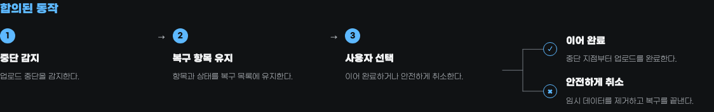

<p align="center">
  
</p>

<h1 align="center">Hope</h1>

<p align="center">
  <strong>
    Hope는 사람이 AI와 함께 일하면서도 작업을 보고, 이해하고, 통제할 수
    있도록 돕습니다.
  </strong>
</p>

<p align="center"><a href="README.md">English</a></p>

AI가 작업을 빠르게 끝내더라도 무엇이 결정되었는지, 어떤 근거가 있는지,
무엇이 아직 불확실한지는 그 작업을 책임질 사람에게 분명하지 않을 수
있습니다.

Hope는 이런 순간마다 필요한 도구를 제공합니다.

구현 전에 작업에 대한 이해를 맞추고, 결과물을 엄격하게 검토하고, 코드 변경을
이해하고, 코드베이스 유지보수를 점검하고, 완성한 작업물을 다듬고, 의미를 잃지
않으면서 글을 명확하게 만듭니다.

현재 지원하는 전달 방식은 Codex와 Claude Code용 플러그인입니다.

## 설치

현재 Hope 배포판은 Codex와 Claude Code에 설치할 수 있습니다.

버전별 변경 내역과 다운로드할 수 있는 패키지는 GitHub
[Releases](https://github.com/dkstm95/hope/releases)에서 제공합니다.

<p>
  
  
</p>

다음 항목들이 필요합니다.

- Node.js 22 이상
- Diff를 사용하려면 인증된 [GitHub CLI](https://cli.github.com/)가
  필요합니다. 필요하다면 먼저 `gh auth login`을 실행하세요.

가장 간단한 설치 방법은 AI에게 다음과 같이 요청하는 것입니다.

```text
https://github.com/dkstm95/hope 저장소의 Hope를 현재 AI 도구에 설치해 주세요.
저장소의 README에 따라 설치하고, 다시 시작해야 한다면 알려 주세요.
```

직접 설치하려면 사용 중인 도구의 명령을 실행하세요.

```bash
# Codex
codex plugin marketplace add dkstm95/hope
codex plugin add hope@hope
```

```bash
# Claude Code
claude plugin marketplace add dkstm95/hope
claude plugin install hope@hope
```

설치한 뒤 새 Codex 또는 Claude Code 세션을 시작하세요.

### Hope 업데이트

- **Claude Code:** `/plugin` → **Marketplaces**에서 Hope 마켓플레이스의 자동
  업데이트를 켜세요. 업데이트 알림이 나타나면 `/reload-plugins`를 실행하세요.
- **Codex:** `codex plugin marketplace upgrade hope`를 실행한 다음
  `codex plugin add hope@hope`를 실행하고 새 세션을 시작하세요.

## 기능

필요한 작업을 고르세요.

<details>
<summary><strong>Align</strong> — 구현 전에 작업 이해를 맞춥니다</summary>

Align은 사용자와 AI 간 이해를 일치시킵니다.

코드베이스와 같은 확인 가능한 근거를 기반으로 현재 이해한 내용을 설명한 뒤, 결과를 바꿀 수 있는 선택들을 질문합니다.

합의가 끝나면 프로젝트 안에 하나의 독립 실행형 HTML 문서를 만듭니다. 현재 의도를
가장 잘 보이게 유지하고, 중요한 변경은 같은 파일의 새 리비전으로 남기며, 이 문서를
구현 계약으로 사용합니다. 프로젝트와 함께 보관하도록 권하지만 자동으로 스테이징하지
않습니다.

> [!NOTE]
> Align은 명시적인 승인을 기다리며 작업을 직접 구현하지 않습니다. 이후 세션에서는
> 사용자가 문서 경로를 알려 줄 때만 사용하며, 저장소 전체에서 “최신” 합의를
> 추측하지 않습니다.


*실패한 업로드 복구 합의로 생성한 실제 Align HTML 결과물입니다.*

| 합의된 동작 · 다크 | 결정과 구현 선택 · 라이트 |
| --- | --- |
| [](assets/readme/hope-align-behavior-ko.png) | [](assets/readme/hope-align-decisions-ko.png) |

> 예시: “실패한 업로드 복구 화면을 추가하려고 해요. 구현 전에 재시도 동작과
> 화면 배치를 함께 정리해 주세요.”

</details>

<details>
<summary><strong>Diff</strong> — 무엇이 바뀌었고 어떻게 판단할지 이해합니다</summary>

코드는 바뀌었지만 담당자가 동작을 예측하거나 설명하고 판단하지 못한다면 그 간극은 인지 부채로 남습니다.

Diff는 코드보다 동작을 먼저 설명하고 중요한 주장에 근거를 연결합니다.

능동적인 이해를 돕기 위해 시각 자료, 마이크로월드, 퀴즈를 활용합니다.

변경 내용을 쉬운 한 문장으로 먼저 보여 준 뒤 요약, 동작 변화, 검토 항목,
근거와 범위를 차례로 설명합니다. 구현 세부는 접힌 근거 안에서 확인할 수 있습니다.

그렇게 완성된 HTML 결과물은 변경을 이해하고 판단한 뒤 그 이해를 후속 결정과 작업에 활용하도록 돕습니다.

> [!NOTE]
> Diff는 승인이나 기각을 추천하거나 PR을 변경하지 않습니다.
> PR 토론과 CI 결과를 확인하지 않으며 테스트, 빌드, 린터, 저장소 코드도 실행하지 않습니다.


*[nanoid PR #601](https://github.com/ai/nanoid/pull/601)로 생성한 실제 Diff HTML 결과물입니다.*

| 핵심 변경 | 동작 모델 |
| --- | --- |
| [](assets/readme/hope-diff-core-ko.png) | [](assets/readme/hope-diff-behavior-ko.png) |
| 설명 도구 선택 | 구현 세부와 근거 |
| [](assets/readme/hope-diff-teaching-ko.png) | [](assets/readme/hope-diff-code-ko.png) |
| 판단에 필요한 다음 확인 | 근거와 확인 범위 |
| [](assets/readme/hope-diff-review-ko.png) | [](assets/readme/hope-diff-evidence-ko.png) |

> [!NOTE]
> URL 없이 실행하면 먼저 현재 브랜치의 PR을 찾습니다.
> 없으면 저장소에서 사용자가 만든 최신 열린 PR을 선택합니다.
> PR이 바뀌면 Diff를 다시 실행하세요.

</details>

<details>
<summary><strong>Toxic Review</strong> — 놓친 중요한 위험을 찾습니다</summary>

Toxic Review는 냉정하게, 비판적으로 검토하고, 근거가 있는 지적을 우선순위가 있는 리뷰로 정리합니다.

> [!NOTE]
> 리뷰어가 한 명이어도 항상 새 컨텍스트에서 검토합니다. 서로 다른 중요한 위험을
> 확인해야 할 때만 여러 독립 리뷰어를 사용합니다.
>
> 모든 리뷰어는 별도의 모델 호출을 사용합니다.
>
> 실행 규모를 줄이려면 Hope에 리뷰어 수를 제한해 달라고 요청하세요.

> 예시: “데이터베이스 마이그레이션 계획을 검토해 주세요.”

</details>

<details>
<summary><strong>Polish</strong> — 완성된 작업을 다듬습니다</summary>

Polish는 완성된 결과나 현재 저장소 변경분을 검토하고, 범위를 제한한
개선 작업을 적용합니다.

서로 독립된 검토 에이전트가 가치 있는 개선만 찾습니다. 코드에서는 기존 헬퍼 재사용,
단순성, 효율, 추상화 수준을 확인합니다. 마무리 에이전트가 근거를 판정하고 추측에
가깝거나 위험한 제안을 제외한 뒤, 함께 적용할 수 있는 변경만 반영하고 검증합니다.

버그 탐색, 기능 개발, 마이그레이션, 광범위한 유지보수는 하지 않습니다.

> [!NOTE]
> Polish는 기본적으로 로컬 대상을 수정합니다. 파일을 바꾸지 않고 판정한 후보만
> 받으려면 읽기 전용 검토를 요청하세요.
>
> 각 검토자와 마무리 작업자는 새 컨텍스트에서 별도의 모델 호출로 실행됩니다.

> 예시: “동작을 바꾸지 말고 현재 변경분을 단순화해 주세요.”

</details>

<details>
<summary><strong>Sweep</strong> — 코드베이스를 청소하고 안전하게 유지보수합니다</summary>

Sweep은 코드베이스를 읽기 전용으로 검토합니다.

깨진 참조, 오래된 코드, 근거 없는 추상화, 검증 공백, 의존성·라이선스 위험,
전달 과정의 낭비, 불분명한 소유권 등이 대상입니다.

검토 결과 목록에서 후보를 선택하면 작업을 시작합니다.

> 예시: “이 코드베이스를 Sweep해 주세요.”

</details>

<details>
<summary><strong>Write</strong> — 의미를 지키며 글을 명확하게 만듭니다</summary>

Write는 의미, 사실, 불확실성, 인용, 사용자의 말투를 잃지 않으면서 글을 작성하고, 고치고, 검토합니다.

Hope는 구현과 다른 Skill을 포함한 작업 안에서도 Write를 사용합니다. Write는 두
번째 워크플로를 만들거나 작업 범위를 바꾸지 않고 공통 기준을 적용합니다.

Write의 공통 기준은 조지 오웰의
[「Politics and the English Language」](https://www.orwellfoundation.com/the-orwell-foundation/orwell/essays-and-other-works/politics-and-the-english-language/)에
담긴 여섯 가지 원칙을 바탕으로 합니다.

> 예시: “이 장애 상황 공지를 이해하기 쉽게 고쳐 주세요.”

</details>

## 라이선스

[MIT](LICENSE)
