<p align="center">
  
</p>

<h1 align="center">Hope</h1>

<p align="center">
  <strong>
    Hope는 사람이 AI와 함께 일하면서도 작업을 보고, 이해하고, 통제할 수
    있도록 돕습니다.
  </strong>
</p>

<p align="center">
  <a href="#설치"></a>
  <a href="#설치"></a>
</p>

<p align="center"><a href="README.md">English</a></p>

AI가 작업을 빠르게 끝내더라도 무엇이 결정되었는지, 어떤 근거가 있는지,
무엇이 아직 불확실한지는 그 작업을 책임질 사람에게 분명하지 않을 수
있습니다.

Hope는 이런 순간마다 필요한 도구를 제공합니다.

구현 전에 작업에 대한 이해를 맞추고, 결과물을 엄격하게 검토하고, 코드 변경을
이해하고, 코드베이스 유지보수를 점검하고, 완성한 작업물을 다듬고, 의미를 잃지
않으면서 글을 명확하게 만듭니다.

## 설치

Hope 플러그인은 Codex와 Claude Code에 설치할 수 있습니다.

다음 항목들이 필요합니다.

- Node.js 20 이상
- Diff를 사용하려면 인증된 [GitHub CLI](https://cli.github.com/)가
  필요합니다. 필요하다면 먼저 `gh auth login`을 실행하세요.

가장 간단한 설치 방법은 AI에게 다음과 같이 요청하는 것입니다.

```text
https://github.com/dkstm95/hope 저장소의 Hope를 현재 AI 도구에 설치해 주세요.
저장소의 README에 따라 설치하고, 다시 시작해야 한다면 알려 주세요.
```

직접 설치하려면 사용 중인 도구의 명령을 실행하세요.

```bash
# Codex
codex plugin marketplace add dkstm95/hope
codex plugin add hope@hope
```

```bash
# Claude Code
claude plugin marketplace add dkstm95/hope
claude plugin install hope@hope
```

설치한 뒤 새 Codex 또는 Claude Code 세션을 시작하세요.

### Hope 업데이트

- **Claude Code:** `/plugin` → **Marketplaces**에서 Hope 마켓플레이스의 자동
  업데이트를 켜세요. 업데이트 알림이 나타나면 `/reload-plugins`를 실행하세요.
- **Codex:** `codex plugin marketplace upgrade hope`를 실행한 다음
  `codex plugin add hope@hope`를 실행하고 새 세션을 시작하세요.

## 기능

필요한 작업을 고르세요.

기능을 펼치면 동작, 제약, 예시를 모두 확인할 수 있습니다.

<details>
<summary><strong>Align</strong> — 구현 전에 작업 이해를 맞춥니다</summary>

목표, 범위, 예상 동작, 중요한 선택에 대한 오해는 구현이 시작될 때까지 남을 수 있습니다.

Align은 확인 가능한 근거를 먼저 읽고 작업의 위험도에 맞춰 질문하며, 사실, 결정, 제안, 가정, 열린 질문을 구분합니다.

현재 공유된 이해는 목표, 다음 행동, 핵심 합의 세 가지를 첫 화면에 담은 하나의 HTML 결과물이 됩니다.

근거와 작업 세부 내용은 기본 흐름을 복잡하게 만들지 않으면서 필요할 때 확인할 수 있습니다.

사용자 화면이 달라지는 작업은 구현 전에 하나의 표준 화면 내용을 넓은 화면과 좁은 화면으로 비교합니다.

> [!NOTE]
> Align은 명시적인 승인을 기다리며 작업을 직접 구현하지 않습니다.

> 예시: “실패한 업로드 복구 화면을 추가하려고 해요. 구현 전에 재시도 동작과
> 화면 배치를 함께 정리해 주세요.”

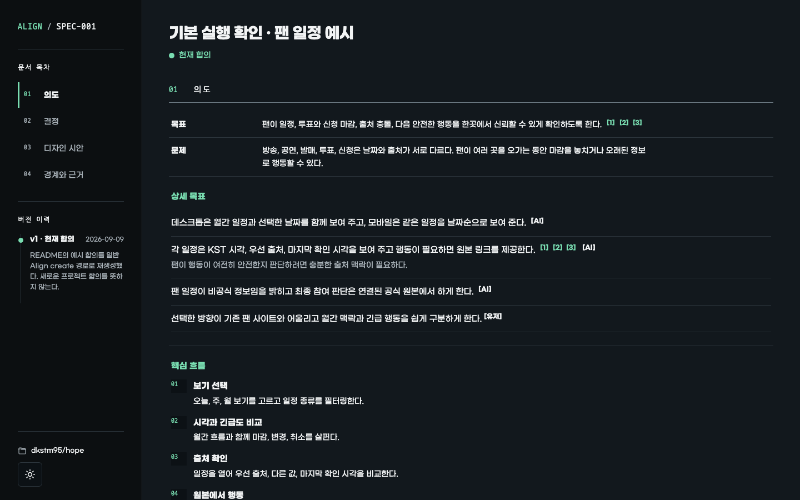

*실패한 업로드 복구 화면을 위한 실제 Align HTML 결과물입니다.*

| 범위와 성공 조건 | 반응형 미리보기 |
| --- | --- |
| [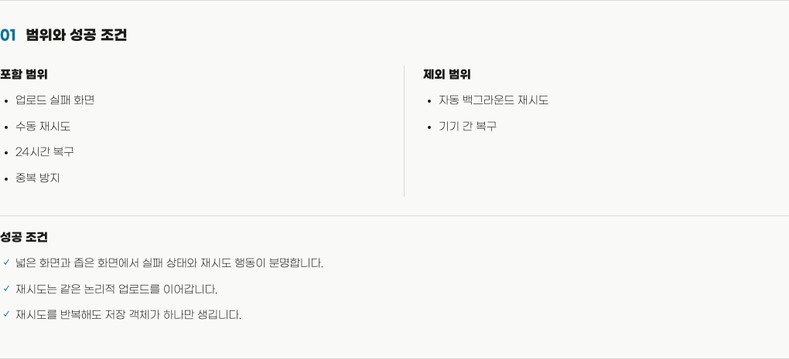](assets/readme/hope-align-scope-ko.png) | [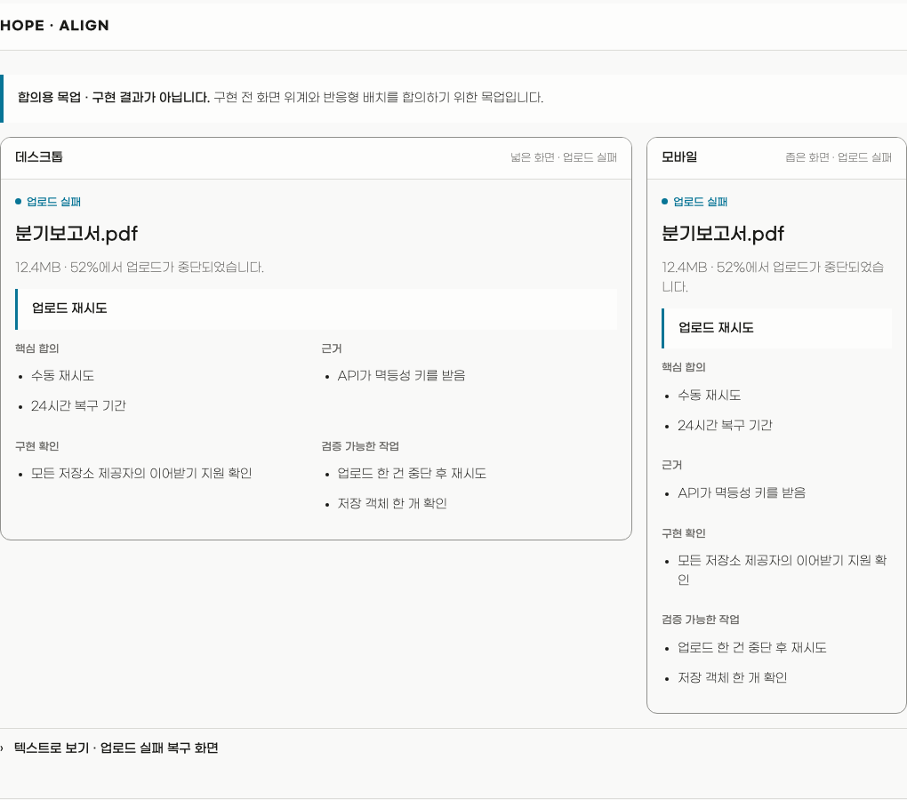](assets/readme/hope-align-preview-ko.png) |
| 핵심 합의와 보조 정보 | 검증 가능한 작업 |
| [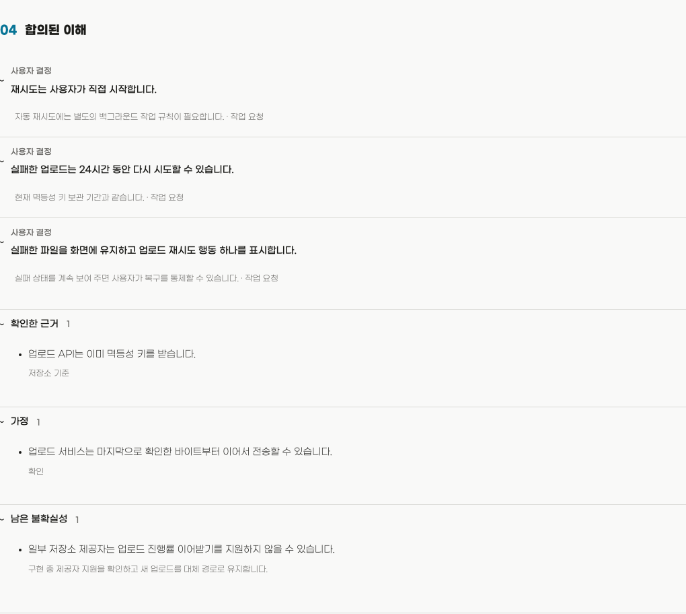](assets/readme/hope-align-understanding-ko.png) | [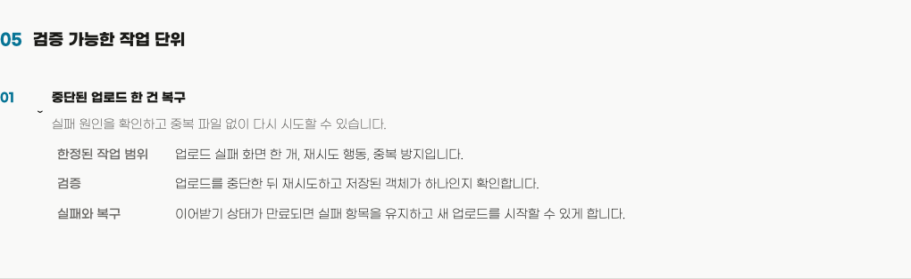](assets/readme/hope-align-work-ko.png) |

</details>

<details>
<summary><strong>Diff</strong> — 무엇이 바뀌었고 어떻게 판단할지 이해합니다</summary>

코드는 바뀌었지만 담당자가 동작을 예측하거나 설명하고 판단하지 못한다면 그 간극은 인지 부채로 남습니다.

Diff는 코드보다 동작을 먼저 설명하고 중요한 주장에 근거를 연결합니다.

능동적인 탐색이 도움이 되면 시각 자료, 마이크로월드, 근거가 있는 퀴즈를 활용합니다.

완성된 로컬 HTML 리뷰는 변경을 이해하고 판단한 뒤 그 이해를 후속 결정과 작업에 활용하도록 돕습니다.

> [!NOTE]
> Diff는 승인이나 기각을 추천하거나 PR을 변경하지 않습니다.
> PR 토론과 CI 결과를 확인하지 않으며 테스트, 빌드, 린터, 저장소 코드도 실행하지 않습니다.

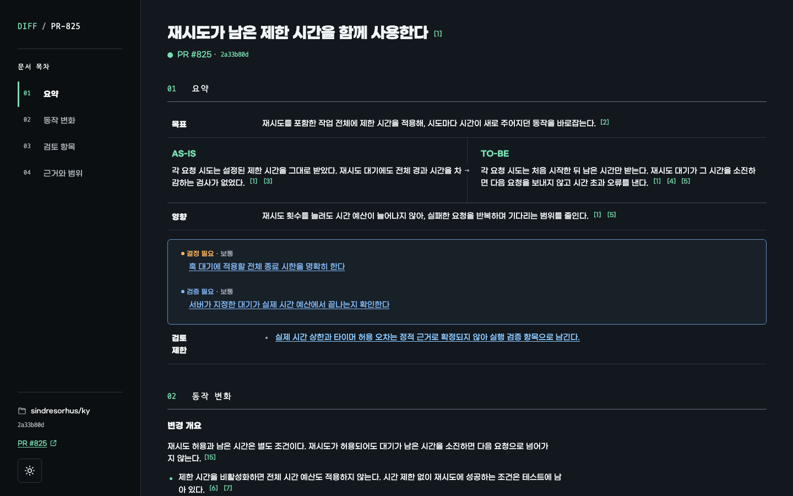

*[nanoid PR #601](https://github.com/ai/nanoid/pull/601)로 생성한 실제 Diff HTML 결과물입니다.*

| 핵심 변경 | 동작 모델 |
| --- | --- |
| [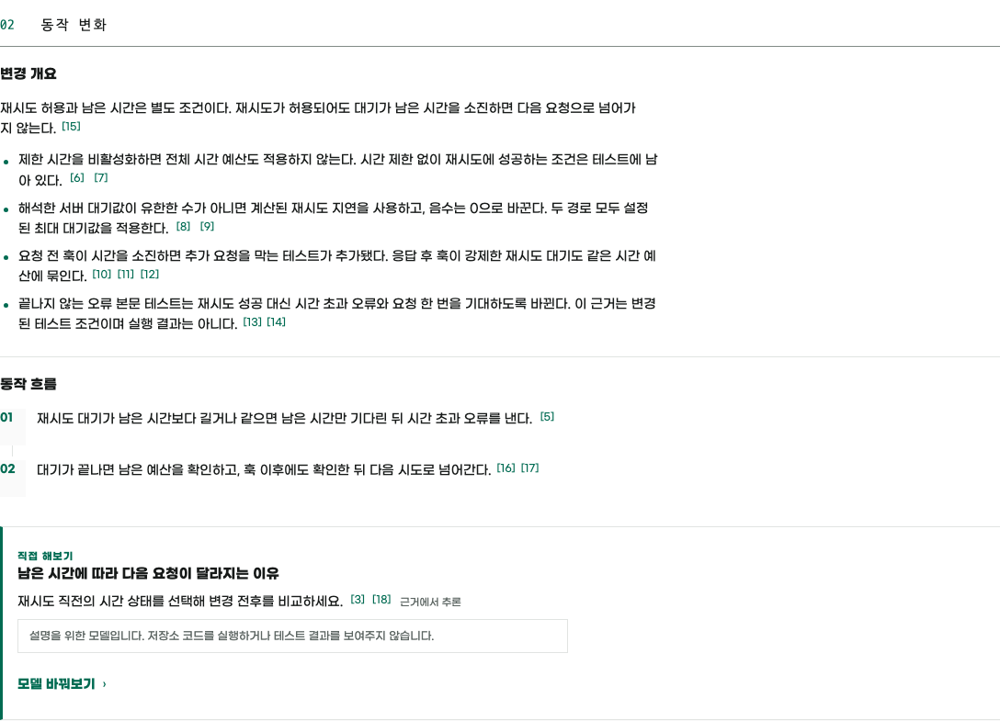](assets/readme/hope-diff-core-ko.png) | [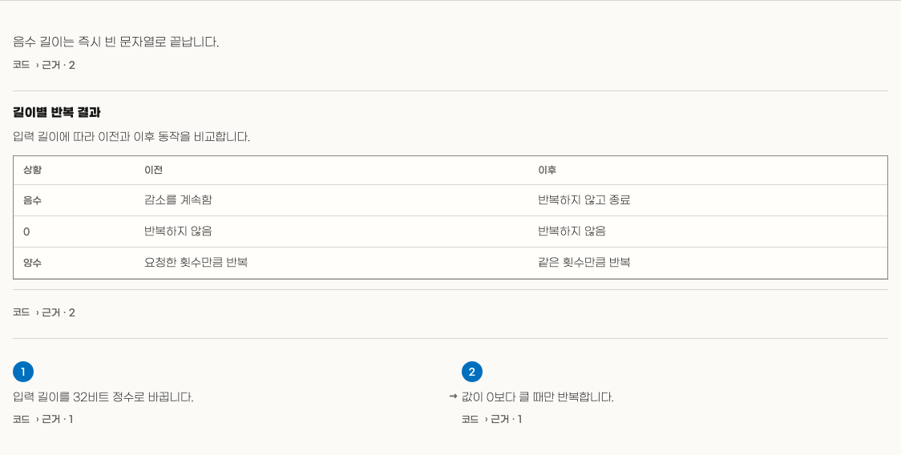](assets/readme/hope-diff-behavior-ko.png) |
| 설명 도구 선택 | 근거가 연결된 코드 흐름 |
| [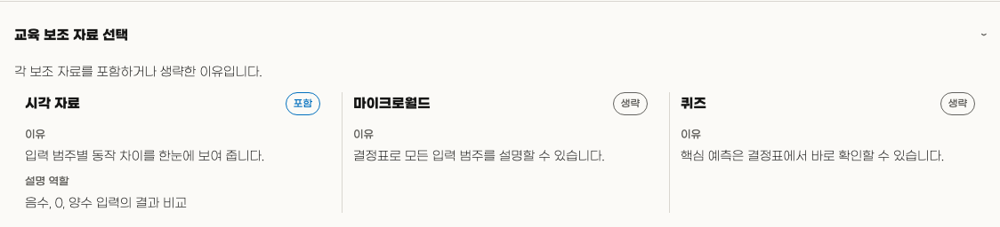](assets/readme/hope-diff-teaching-ko.png) | [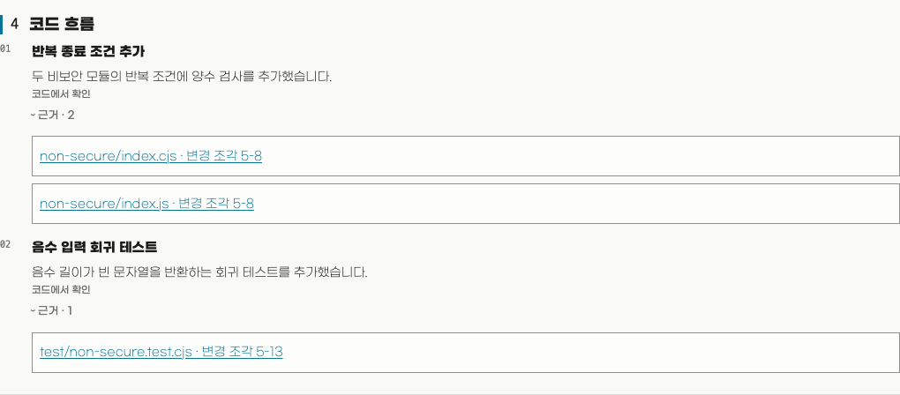](assets/readme/hope-diff-code-ko.png) |
| 판단에 필요한 다음 확인 | 근거와 확인 범위 |
| [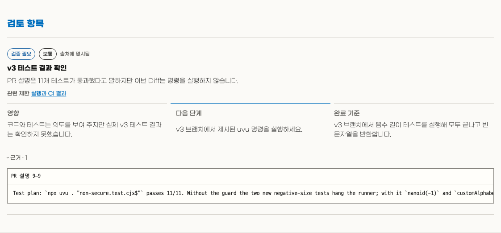](assets/readme/hope-diff-review-ko.png) | [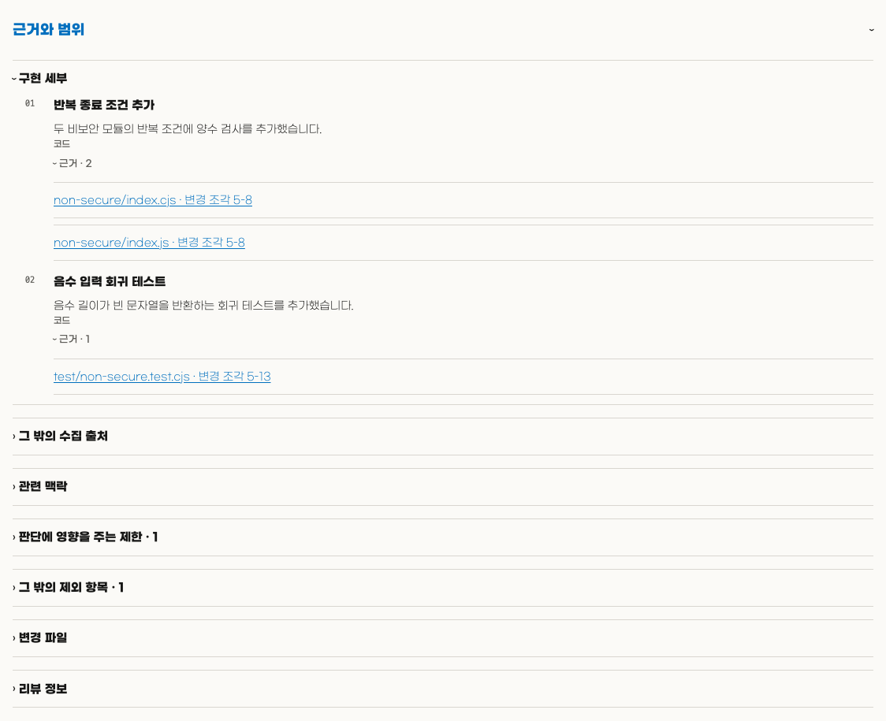](assets/readme/hope-diff-evidence-ko.png) |

> [!NOTE]
> URL 없이 실행하면 먼저 현재 브랜치의 PR을 찾습니다.
> 없으면 저장소에서 사용자가 만든 최신 열린 PR을 선택합니다.
> PR이 바뀌면 Diff를 다시 실행하세요.

</details>

<details>
<summary><strong>Toxic Review</strong> — 놓친 중요한 위험을 찾습니다</summary>

Toxic Review는 근거가 있는 지적을 우선순위가 있는 하나의 리뷰로 정리합니다.

작업은 엄격하게 보되 사람을 공격하거나 비판을 억지로 만들지 않습니다.

> [!NOTE]
> Toxic Review는 한 번의 집중 검토로 충분하면 리뷰어 한 명을 사용하고, 서로 다른
> 중요한 위험을 확인해야 할 때는 여러 독립 리뷰어를 실행할 수 있습니다.
>
> 리뷰어를 여러 명 사용하면 각각 별도의 모델 호출이 발생하므로 병렬 실행은 시간을
> 줄일 수 있어도 토큰 사용량은 줄이지 않습니다.
>
> 실행 규모를 줄이려면 Hope에 리뷰어 수를 제한해 달라고 요청하세요.

> 예시: “데이터베이스 마이그레이션 계획을 검토해 주세요.”

</details>

<details>
<summary><strong>Polish</strong> — 확정한 내용을 지키며 완성된 작업을 다듬습니다</summary>

Polish는 바꾸지 않을 내용을 먼저 정하고 명확한 범위 안에서 작업물을 한 번 다듬습니다.

확정한 동작과 의미를 지키면서 무엇을 바꾸고 확인했는지 알려 줍니다.

중요한 결정이 필요하면 수정에 숨기지 않고 멈춥니다.

> 예시: “현재 작업물을 다듬어 주세요.”

</details>

<details>
<summary><strong>Sweep</strong> — 코드베이스를 청소하고 안전하게 유지보수합니다</summary>

Sweep은 주기별 프로필 대신 코드베이스에 맞춘 유지보수 작업을 한 번 실행합니다.

정확한 스냅샷을 점검하고 파일을 바꾸기 전에 제한된 계획을 보여 줍니다.

깨진 참조와 설정 불일치, 사용하지 않거나 오래된 코드·테스트·문서·설정,
반복되거나 부족하거나 성급한 추상화, 테스트와 문서 공백, 의존성·보안·라이선스·
호환성 위험, 성능·패키지·빌드·CI 낭비, 아키텍처·지원·릴리스·복구 준비 상태를
점검합니다.

불완전한 근거는 문제가 없는 것처럼 표시하지 않습니다.

Sweep은 승인한 행동 보존형 작업만 적용하며, 행동·공개 계약·의존성 변경은
별도 구현 작업으로 넘깁니다.

> 예시: “이 코드베이스를 Sweep해 주세요.”

</details>

<details>
<summary><strong>Write</strong> — 의미를 지키며 글을 명확하게 만듭니다</summary>

Write는 의미, 사실, 불확실성, 인용, 사용자의 말투를 잃지 않으면서 글을 작성하고, 고치고, 검토합니다.

Hope는 다른 작업에서도(프롬프트, 문서, 응답, 인터페이스 문구, 오류, 주석, 이름) Write를 적용합니다.

Write의 공통 기준은 조지 오웰의
[「Politics and the English Language」](https://www.orwellfoundation.com/the-orwell-foundation/orwell/essays-and-other-works/politics-and-the-english-language/)에
담긴 여섯 가지 원칙을 바탕으로 합니다.

> 예시: “이 장애 상황 공지를 이해하기 쉽게 고쳐 주세요.”

</details>

<details>
<summary><strong>Settings</strong> — Hope의 언어와 테마를 설정합니다</summary>

Settings는 지원되는 언어와 초기 `system`, `light`, `dark` 테마를 공통 기본값으로 저장합니다.

하네스와 설치된 플러그인이 이 설정을 함께 사용하며, 변경 사항은 새 결과물에만 적용됩니다.

</details>

## 라이선스

[MIT](LICENSE)
