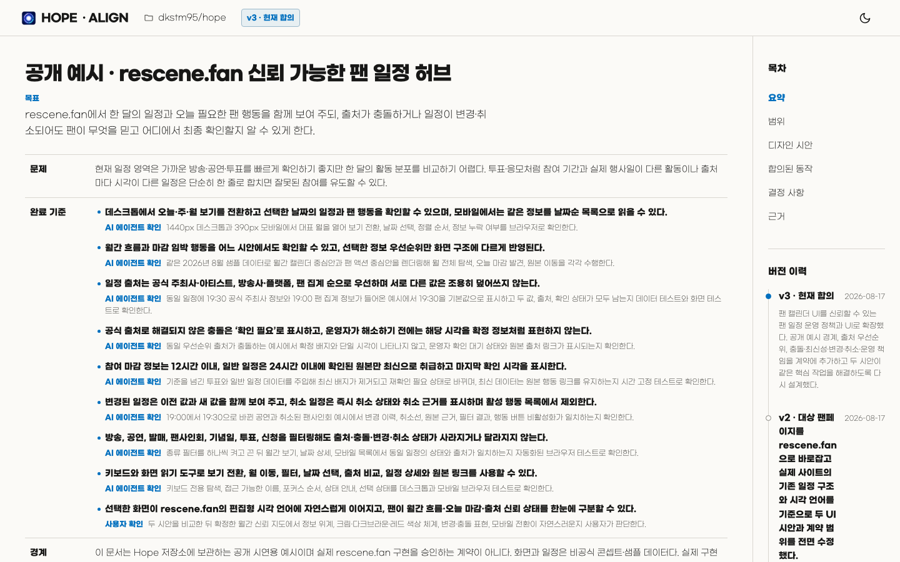
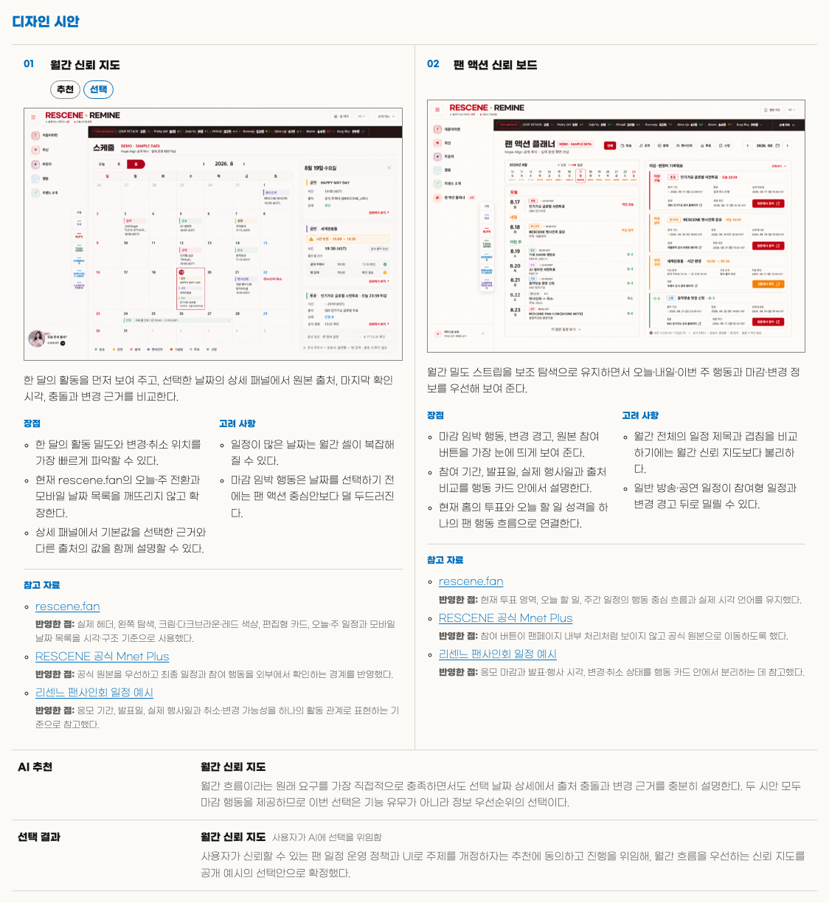
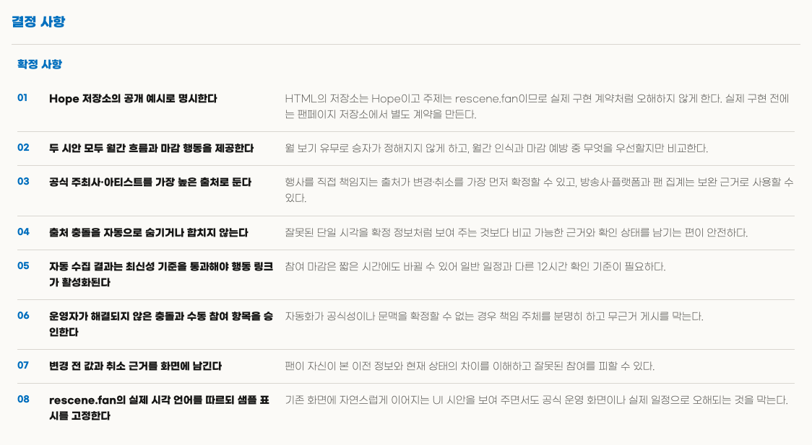
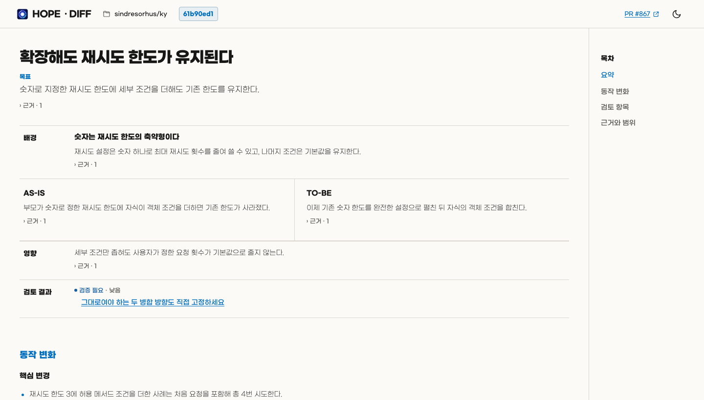
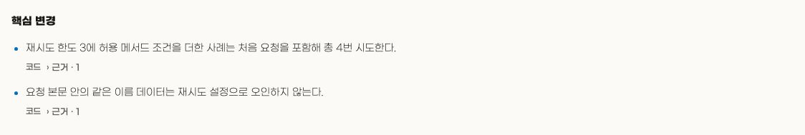
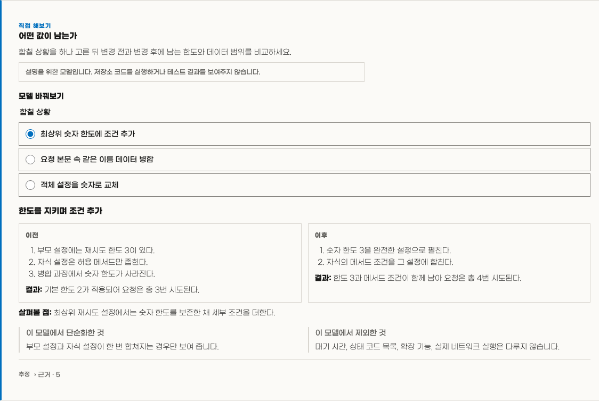
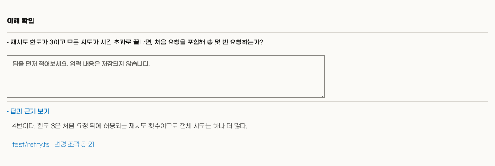

<p align="center">
  
</p>

<h1 align="center">Hope</h1>

<p align="center">
  <strong>
    Hope는 사람이 AI와 함께 일하면서도 작업을 보고, 이해하고, 통제할 수 있도록 돕습니다.
  </strong>
</p>

<p align="center"><a href="README.md">English</a></p>

<br>

## 기능

### ✨ Align — 구현 전 작업 이해를 맞추고 `의도 부채`를 방지합니다

코드베이스와 같은 확인 가능한 근거를 기반으로 이해한 내용을 설명하고, 결과를 바꿀 수 있는 선택들을 질문하며, 사용자와 AI 간 이해를 일치시킵니다.

합의가 끝나면 프로젝트 안에 하나의 HTML 문서를 만듭니다.

문서에는 하나의 합의된 목표와 완료 기준들이 존재합니다.
각 기준에는 확인 방법과 AI와 사용자 중 누가 판단할지가 포함됩니다.
중요한 변경은 동일 파일의 새 버전으로 남기며, 이 문서를 구현 계약으로 사용합니다.

첨부 자료가 없는 중요한 UI 작업에서는 프로젝트를 먼저 살피고, 필요하면 웹 서치로 조사해 2~3개의 이미지 시안을 제시합니다.

> [!NOTE]
> Align 문서는 프로젝트 문서입니다. 사용자가 제외하지 않는 한 관련 변경과
> 함께 버전 관리에 포함합니다.

**전체 HTML 예시:** [출처 충돌·변경·취소와 확인 책임을 합의한 팬 일정 Align 문서를 엽니다.](docs/alignments/rescene-fan-calendar.html)

아래 이미지는 이 Align 예시에서 만들었습니다. 샘플 데이터를 사용하며 실제
`rescene.fan` 운영 화면이 아닙니다.



| 비교한 UI 방향 | 출처와 데이터 운영 결정 |
| --- | --- |
| [](assets/readme/hope-align-directions.png) | [](assets/readme/hope-align-decisions.png) |

---

### ✨ Diff — 무엇이 바뀌었고 어떻게 판단할지 이해하여 `인지 부채`를 방지합니다

코드는 바뀌었지만 담당자가 동작을 예측하거나 설명하고 판단하지 못한다면 그 간극은 인지 부채로 남습니다.

Diff는 하나의 HTML 문서를 만들어 코드보다 동작을 먼저 설명하고 중요한 주장에 근거를 연결합니다.

능동적인 이해를 돕기 위해 시각 자료, 마이크로월드, 퀴즈를 활용하기도 합니다.

이를 통해 변경을 이해하고 판단한 뒤 그 이해를 후속 결정과 작업에 활용하도록 돕습니다.

> [!NOTE]
> URL 없이 실행하면 먼저 현재 브랜치의 PR을 찾습니다.
> 없으면 저장소에서 사용자가 만든 최신 열린 PR을 선택합니다.
> PR이 바뀌면 Diff를 다시 실행하세요.

> [!NOTE]
> 아래 이미지는 [Ky PR #867](https://github.com/sindresorhus/ky/pull/867)로 생성한 실제 한국어 Diff HTML 결과물입니다.

**전체 HTML 예시:** [Ky PR #867의 재시도 설정을 마이크로월드와 퀴즈로 설명한 Diff 결과물을 엽니다.](docs/diffs/ky-867-retry-extend.html)



| 핵심 변경 | 인터랙티브 마이크로월드 |
| --- | --- |
| [](assets/readme/hope-diff-core.png) | [](assets/readme/hope-diff-microworld.png) |

[](assets/readme/hope-diff-quiz.png)

---

### Toxic Review — 결과물을 냉정하게, 비판적으로 검토합니다

서로 다른 중요한 위험을 확인해야 할 때 여러 독립된 서브 에이전트를 사용합니다.

메인 에이전트는 검토 결과 중 타당한 것들을 판별합니다.

실행 규모를 줄이려면 Hope에 리뷰어 수를 제한해 달라고 요청하세요.

---

### Polish — 구현된 결과물을 다듬습니다

서로 독립된 검토 에이전트가 가치 있는 개선을 찾습니다.

코드에서는 기존 헬퍼 재사용, 단순성, 효율, 추상화 수준 등을 확인합니다.

메인 에이전트는 결과를 판정하고, 적용할 수 있는 변경만 반영하고 검증합니다.

버그 탐색, 기능 개발, 마이그레이션, 광범위한 유지보수는 하지 않습니다.

---

### Sweep — 코드베이스를 청소합니다

코드베이스를 읽기 전용으로 검토하며,
깨진 참조, 오래된 코드, 근거 없는 추상화, 검증 공백, 의존성·라이선스 위험, 전달 과정의 낭비, 불분명한 소유권 등이 대상입니다.

검토 결과 목록에서 후보를 선택하면 작업을 시작합니다.

---

Write — 의미를 보존하며 명확하게 글을 작성합니다

Hope는 구현과 다른 Skill을 포함한 작업 안에서도 Write를 사용합니다.

Write의 공통 기준은 조지 오웰의
[「Politics and the English Language」](https://www.orwellfoundation.com/the-orwell-foundation/orwell/essays-and-other-works/politics-and-the-english-language/)에
담긴 여섯 가지 원칙을 바탕으로 합니다.

<br>

## 설치

다음 항목들이 필요합니다.
- Node.js 22 이상
- Diff를 사용하려면 인증된 [GitHub CLI](https://cli.github.com/)가 필요합니다. 필요하다면 먼저 `gh auth login`을 실행하세요.

가장 간단한 설치 방법은 AI에게 다음과 같이 요청하는 것입니다.

```text
https://github.com/dkstm95/hope 저장소의 Hope를 현재 AI 도구에 설치해 주세요.
저장소의 README에 따라 설치하고, 다시 시작해야 한다면 알려 주세요.
```

직접 설치하려면 사용 중인 도구의 명령을 실행하세요.

예시:
```bash
# Codex
codex plugin marketplace add dkstm95/hope
codex plugin add hope@hope
```

```bash
# Claude Code
claude plugin marketplace add dkstm95/hope
claude plugin install hope@hope
```

## 라이선스

[MIT](LICENSE)
