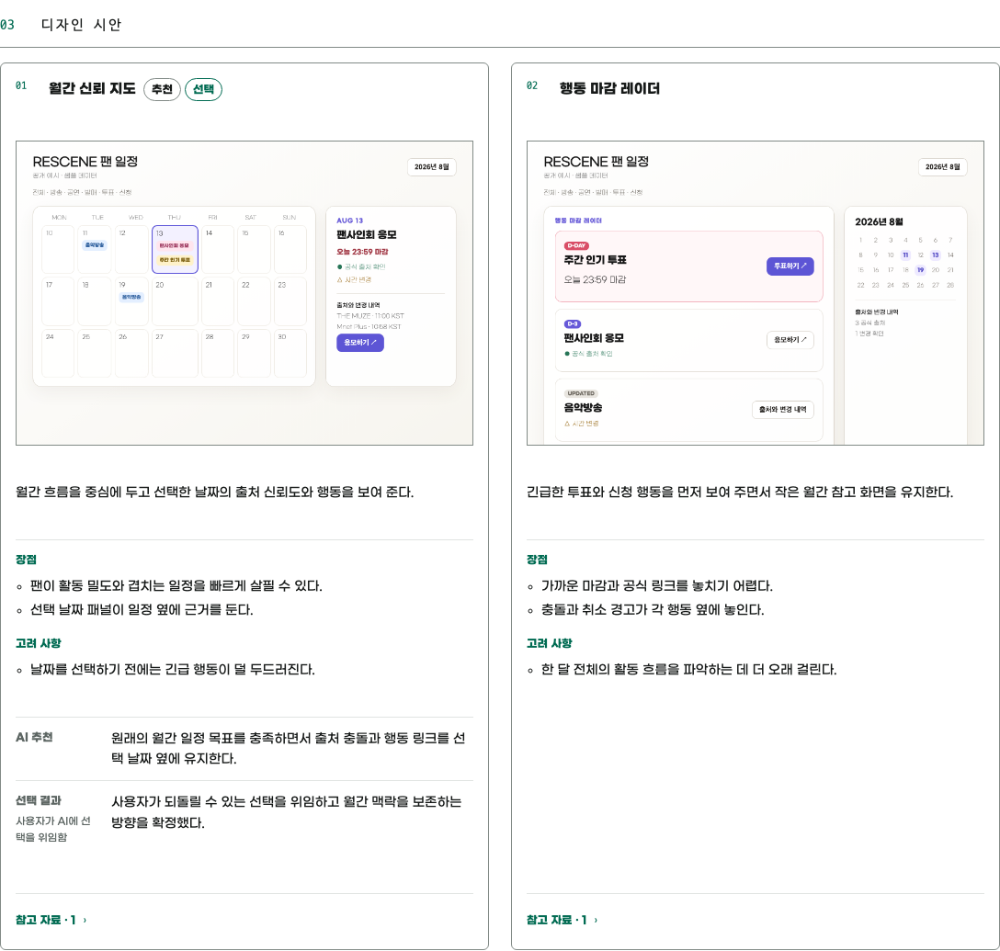
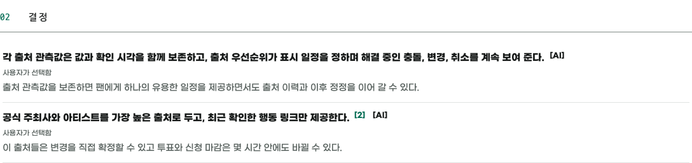
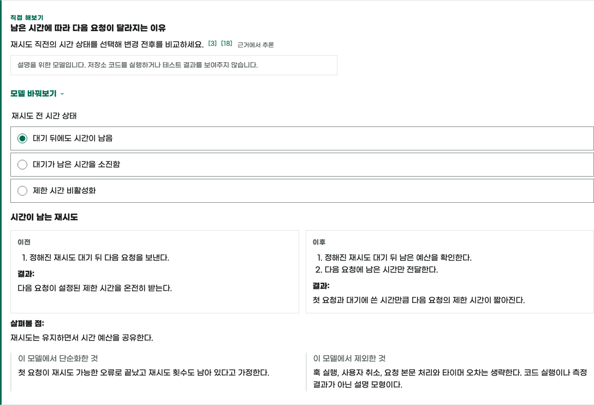
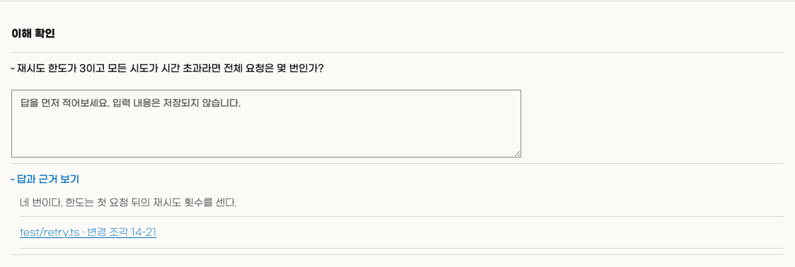
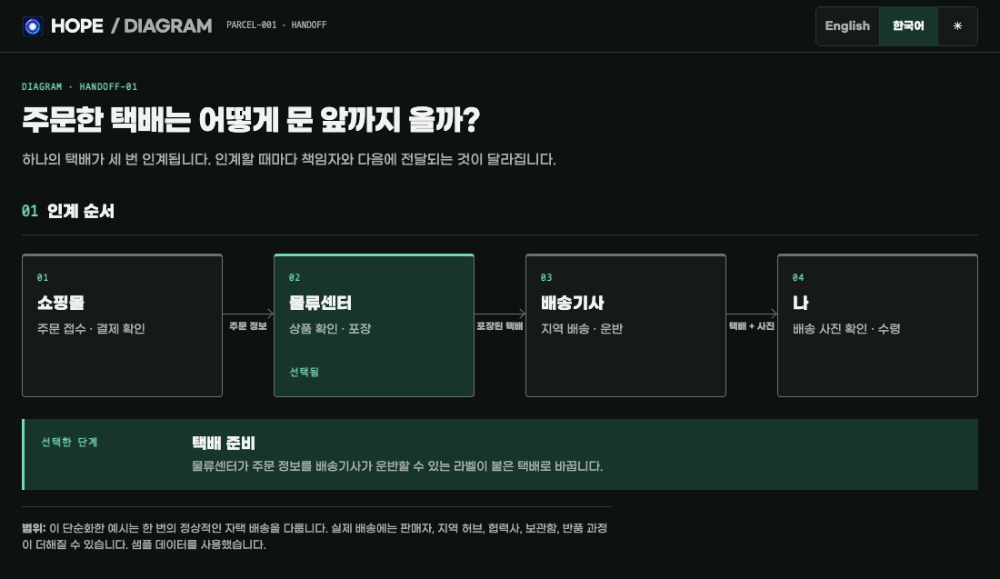

<p align="center">
  
</p>

<h1 align="center">Hope</h1>

<p align="center">
  <strong>
    Hope는 사람이 AI와 함께 일하면서도 작업을 보고, 이해하고, 통제할 수 있도록 돕습니다.
  </strong>
</p>

<p align="center"><a href="README.md">English</a></p>

<br>

## 기능

### 🤝 Align — 구현 전에 의도와 중요한 결정을 함께 이해합니다

Align은 대화와 프로젝트 근거를 바탕으로 결과를 크게 바꿀 선택을 정리합니다.
AI가 조사하고 방향을 추천하면 사용자가 결정하거나 위임합니다. 중요한 의사결정의
모든 분기를 빠짐없이 해결할 때까지 탐색합니다. 일상적인 구현 세부 사항은
구현 작업에서 정합니다.

새로운 합의는 확인하고, 이미 받은 구현 허가가 있으면 이어서 진행합니다.
합의만 요청했다면 거기서 마칩니다. 대화 이후에도 보존할 합의는 프로젝트 안의
독립형 HTML 문서에 기록합니다. 시각적 선택은 비교가 도움이 될 때 이미지
시안 2~3개를 활용합니다.

대화와 산출물 처리 절차는 [Align 스킬](plugins/hope/skills/align/SKILL.md)에
정의되어 있습니다.

> [!IMPORTANT]
> 생성된 Align 문서는 프로젝트 문서입니다. 관련 변경과 함께 버전 관리에
> 포함하는 방식을 기본으로 삼습니다.

**전체 HTML 예시:** [출처 충돌·변경·취소와 판단 책임을 합의한 한국어 팬 일정 Align 기록을 엽니다.](docs/alignments/rescene-fan-calendar.ko.html)


<details>
<summary>Align 세부 이미지 보기</summary>

| 라이트 시각 시안 | 다크 공유 이해와 판단 기준 |
| --- | --- |
| [](assets/readme/hope-align-directions-ko.png) | [](assets/readme/hope-align-decisions-ko.png) |

</details>

---

### 🔎 Diff — 코드 변경을 이해하고 다음 작업을 발견합니다

AI는 큰 코드 변경을 빠르게 만들 수 있습니다. Diff는 엔지니어가 그 결과의 동작, 조건, 경계, 근거를 간결하게 이해하도록 돕습니다.

Diff는 하나의 HTML 문서를 만들어 코드보다 동작을 먼저 설명하고 중요한 주장에 근거를 연결합니다.

능동적인 이해를 돕기 위해 시각 자료, 마이크로월드, 퀴즈를 활용하기도 합니다.

이를 통해 변경의 작동 모델을 세우고 후속 질문, 결정, 작업 아이디어로 이어 갑니다.

> [!NOTE]
> URL 없이 실행하면 먼저 현재 브랜치의 PR을 찾습니다.
> 없으면 저장소에서 사용자가 만든 최신 열린 PR을 선택합니다.
> PR이 바뀌면 Diff를 다시 실행하세요.

아래 이미지는 [Ky PR #825](https://github.com/sindresorhus/ky/pull/825)을 바탕으로
고정된 한국어 Diff 예시에서 만들었습니다.

**전체 HTML 예시:** [Ky PR #825의 전체 시간 제한을 결정표, 마이크로월드, 퀴즈로 설명한 한국어 Diff 결과물을 엽니다.](docs/diffs/ky-825-total-timeout.ko.html)


<details>
<summary>Diff 세부 이미지 보기</summary>

| 라이트 결정표 | 다크 인터랙티브 마이크로월드 |
| --- | --- |
| [](assets/readme/hope-diff-core-ko.png) | [](assets/readme/hope-diff-microworld-ko.png) |

[](assets/readme/hope-diff-quiz-ko.png)

</details>

---

### ⚖️ Toxic Review — Red–Blue 방식으로 결과물을 냉정하게 검토합니다

독립적인 Red 리뷰어가 결과물을 검토합니다. 우선순위가 높거나 조치의 영향이
크거나 실질적으로 불확실한 지적은 새로운 Blue 리뷰어가 검증합니다. 메인
에이전트는 근거를 판정하고 뒷받침되는 조치와 한계를 보고합니다.

역할의 독립성, 검증 기준, 최종 판정은
[Toxic Review 스킬](plugins/hope/skills/toxic-review/SKILL.md)에 정의되어 있습니다.

---

### 🧹 Sweep — 코드베이스를 청소합니다

Sweep을 명시적으로 호출하면 현재 저장소 전체나 지정한 범위에서 기존 동작을
유지하는 정리를 수행합니다. 데드 코드, 중복, 불필요한 작업과 그에 딸린 오래된
지원 자료를 제거합니다. 버그 수정, 제품 결정, 불확실한 제거는 포함하지 않습니다.

범위와 검증 기준은 [Sweep 스킬](plugins/hope/skills/sweep/SKILL.md)에 정의되어
있습니다.

---

### ◇ Diagram — 관계를 더 쉽게 이해할 수 있게 보여 줍니다

Diagram은 위치, 연결, 순서, 계층, 상태, 수량의 형태가 글이나 작은 표보다
의미를 더 분명하게 전달할 때 설명용 다이어그램과 차트를 만들고, 다듬고,
검토합니다.

독립적인 요청을 맡거나 기존 작업 안에서 그 작업의 근거와 산출물 형식을 유지하며
사용합니다. 구성, 접근성, 렌더링 검증 기준은
[Diagram 스킬](plugins/hope/skills/diagram/SKILL.md)에 정의되어 있습니다.

**전체 HTML 예시:** [Diagram이 만든 택배 인계 다이어그램을 엽니다.](docs/visualizations/parcel-handoff.html)



디자인 기준은 Cathryn Lavery의
[Diagram Design](https://github.com/cathrynlavery/diagram-design)을 MIT
라이선스에 따라 각색했습니다. Hope에는 필요한
[원본 고지](plugins/hope/skills/diagram/LICENSE.diagram-design)를 포함하지만,
Diagram Design의 템플릿·스크립트·글꼴·갤러리·제3자 아이콘은 포함하지 않습니다.

---

### ✍️ Write — 의미를 보존하며 명확하게 글을 작성합니다

Hope는 구현과 다른 Skill을 포함한 작업 안에서도 Write를 사용합니다.

Write의 공통 기준은 조지 오웰의
[「Politics and the English Language」](https://www.orwellfoundation.com/the-orwell-foundation/orwell/essays-and-other-works/politics-and-the-english-language/)에
담긴 여섯 가지 원칙을 바탕으로 합니다.

<br>

## 설치

다음 항목들이 필요합니다.

- Node.js 22 이상
- Diff를 사용하려면 인증된 [GitHub CLI](https://cli.github.com/)가 필요합니다. 필요하다면 먼저 `gh auth login`을 실행하세요.

> [!TIP]
> 가장 간단한 설치 방법은 AI에게 다음과 같이 요청하는 것입니다.
>
> ```text
> https://github.com/dkstm95/hope 저장소의 Hope를 현재 AI 도구에 설치해 주세요.
> 저장소의 README에 따라 설치하고, 다시 시작해야 한다면 알려 주세요.
> ```

직접 설치하려면 사용 중인 도구의 명령을 실행하세요.

예시:
```bash
# Codex
codex plugin marketplace add dkstm95/hope
codex plugin add hope@hope
```

```bash
# Claude Code
claude plugin marketplace add dkstm95/hope
claude plugin install hope@hope
```

## 라이선스

[MIT](LICENSE)

Diagram에서 각색한 디자인 지침에는
[Diagram Design MIT 고지](plugins/hope/skills/diagram/LICENSE.diagram-design)도
적용됩니다.
