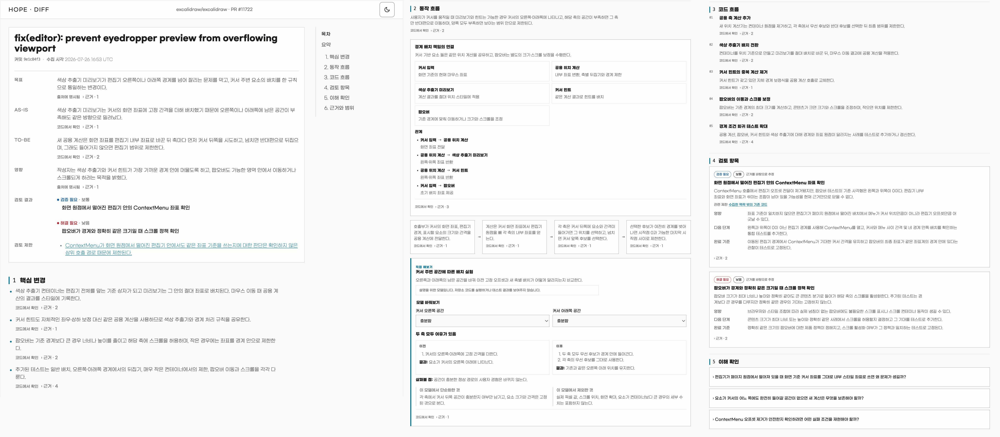
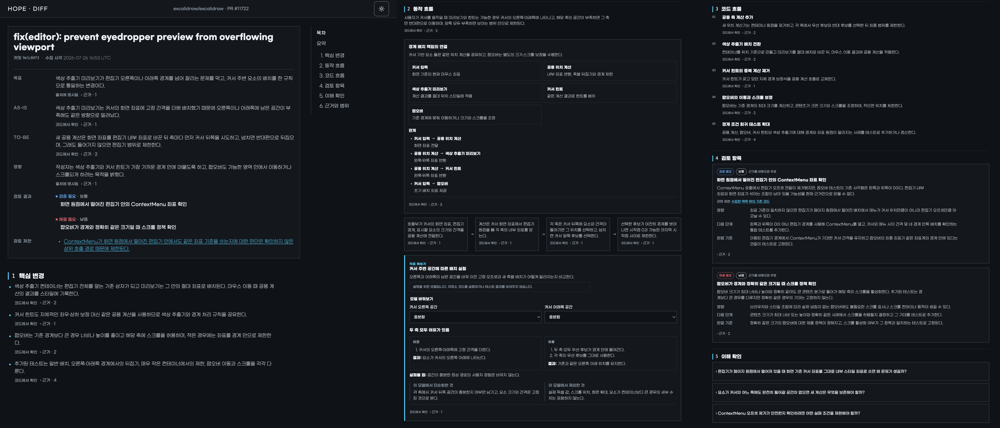

<p align="center">
  
</p>

<h1 align="center">Hope</h1>

<p align="center">
  <strong>
    Hope는 사람과 AI가 더 잘 협업하는 실용적인 방법을 찾습니다.
  </strong>
</p>

<p align="center"><a href="README.md">English</a></p>

## 설치

Hope 플러그인은 Codex와 Claude Code에 설치할 수 있습니다.

다음 항목들이 필요합니다.

- Node.js 20 이상
- Diff를 사용하려면 인증된 [GitHub CLI](https://cli.github.com/)가
  필요합니다. 필요하다면 먼저 `gh auth login`을 실행하세요.

가장 간단한 설치 방법은 Codex나 Claude Code에 다음과 같이 요청하는
것입니다.

```text
https://github.com/dkstm95/hope 저장소의 Hope를 현재 AI 도구에 설치해 주세요.
저장소의 README에 따라 설치하고, 다시 시작해야 한다면 알려 주세요.
```

직접 설치하려면 사용 중인 도구의 명령을 실행하세요.

```bash
# Codex
codex plugin marketplace add dkstm95/hope
codex plugin add hope@hope
```

```bash
# Claude Code
claude plugin marketplace add dkstm95/hope
claude plugin install hope@hope
```

설치한 뒤 새 Codex 또는 Claude Code 세션을 시작하세요.

## 기능

### Diff

Diff는 코드 변경을 근거와 함께 설명합니다. 사용자는 이를 바탕으로 스스로
판단하고, 이해한 내용을 이후 작업에 활용할 수 있습니다.

Diff는 하나의 로컬 HTML 파일을 만듭니다.

> URL 없이 실행하면 대상 저장소에서 사용자가 만든 열린 PR을 찾습니다.
> 특정 PR을 고르려면 해당 GitHub PR URL을 함께 입력하세요.

```text
$hope:diff https://github.com/owner/repository/pull/123
```

<p align="center">
  
</p>

<p align="center">
  
</p>

Diff는 PR 설명, 커밋 제목, 수집할 수 있는 변경 파일의 본문을 읽습니다.
출처에서 관련 경로를 확인하면 검토 대상의 정확한 head 또는 merge-base
커밋에서 제한된 수의 파일을 추가로 읽을 수 있습니다.

관련 없는 저장소 파일을 검색하지 않으며, PR 토론, 리뷰 댓글, CI 결과는
확인하지 않습니다.

테스트, 빌드, 린트 명령이나 그 밖의 저장소 코드도 실행하지 않습니다.

> PR이 바뀌면 Diff를 다시 실행하세요.

### Write

Write는 조지 오웰의 글쓰기 원칙에 따라 글을 쓰고, 고치고, 검토합니다.
익숙한 단어와 직접적인 문장을 쓰고 결론을 먼저 보여줍니다. 뜻, 사실,
불확실성, 인용, 말투는 보존합니다.

```text
Codex
$hope:write 이 wiki 문서를 한 번에 이해할 수 있도록 고쳐 주세요.

Claude Code
/hope:write 이 wiki 문서를 한 번에 이해할 수 있도록 고쳐 주세요.
```

Write는 현재 대화의 언어와 더 구체적인 프로젝트 규칙을 따릅니다. 새 글을
쓰거나, 요청한 파일을 직접 고치거나, 검토만 요청받으면 구체적인 수정안을
제시합니다.

### Settings

Hope에서 사용할 언어와 테마 설정을 저장할 수 있습니다.

저장된 설정이 없으면 Hope는 현재 도구나 운영체제의 언어를 따르고 시스템
테마를 사용합니다.

## 라이선스

[MIT](LICENSE)
