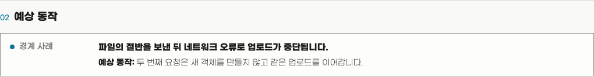

<p align="center">
  
</p>

<h1 align="center">Hope</h1>

<p align="center">
  <strong>
    Hope는 사람이 AI와 함께 일하면서도 작업을 보고, 이해하고, 통제할 수
    있도록 돕습니다.
  </strong>
</p>

<p align="center"><a href="README.md">English</a></p>

AI가 작업을 빠르게 끝내더라도 무엇이 결정되었는지, 어떤 근거가 있는지,
무엇이 아직 불확실한지는 그 작업을 책임질 사람에게 분명하지 않을 수
있습니다.

Hope는 이런 순간마다 필요한 도구를 제공합니다.

구현 전에 작업에 대한 이해를 맞추고, 결과물을 엄격하게 검토하고, 코드 변경을
이해하고, 완성한 작업물을 다듬고, 의미를 잃지 않으면서 글을 명확하게
만듭니다.

## 문제에서 기능 고르기

| 이런 문제를 겪고 있다면 | 기능 | Hope가 돕는 일 |
| --- | --- | --- |
| “AI와 내가 같은 작업을 이해하고 있는지 모르겠어요.” | **Align** | 구현 전에 중요한 오해를 찾고 현재 공유된 이해를 눈에 보이게 만듭니다. |
| “그럴듯해 보이지만 중요한 문제를 놓쳤을까 걱정돼요.” | **Toxic Review** | 필요한 관점으로 작업을 엄격하게 검토하고 근거가 있는 하나의 결과를 반환합니다. |
| “AI가 코드를 바꿨는데 무엇이 달라졌고 어떻게 판단해야 할지 모르겠어요.” | **Diff** | 정확한 변경 하나를 이해하고 판단하며, 그 이해를 후속 작업에 활용하게 돕습니다. |
| “작업은 끝났지만 확정한 동작이나 의미를 바꾸지 않고 다듬고 싶어요.” | **Polish** | 보존 조건과 검증 범위 안에서 작업물을 한 번 다듬습니다. |
| “의미, 사실, 불확실성, 인용, 말투를 잃지 않고 글을 명확하게 만들고 싶어요.” | **Write** | 하나의 공통 작성 기준으로 글을 작성하고, 고치고, 검토합니다. |

## 설치

Hope 플러그인은 Codex와 Claude Code에 설치할 수 있습니다.

다음 항목들이 필요합니다.

- Node.js 20 이상
- Diff를 사용하려면 인증된 [GitHub CLI](https://cli.github.com/)가
  필요합니다. 필요하다면 먼저 `gh auth login`을 실행하세요.

가장 간단한 설치 방법은 AI에게 다음과 같이 요청하는 것입니다.

```text
https://github.com/dkstm95/hope 저장소의 Hope를 현재 AI 도구에 설치해 주세요.
저장소의 README에 따라 설치하고, 다시 시작해야 한다면 알려 주세요.
```

직접 설치하려면 사용 중인 도구의 명령을 실행하세요.

```bash
# Codex
codex plugin marketplace add dkstm95/hope
codex plugin add hope@hope
```

```bash
# Claude Code
claude plugin marketplace add dkstm95/hope
claude plugin install hope@hope
```

설치한 뒤 새 Codex 또는 Claude Code 세션을 시작하세요.

## 기능

### Align

> “AI와 내가 같은 작업을 이해하고 있는지 모르겠어요.”

목표, 범위, 예상 동작, 중요한 선택에 대한 오해는 구현이 시작될 때까지
남을 수 있습니다. Align은 확인 가능한 근거를 먼저 읽고 작업의 위험도에
맞춰 질문하며, 사실, 결정, 제안, 가정, 열린 질문을 구분합니다.

현재 공유된 이해는 범위, 성공 조건, 대표 시나리오, 검증 가능한 작업을
담은 하나의 HTML 결과물이 됩니다. Align은 명시적인 승인을 기다리며
작업을 직접 구현하지 않습니다.

> 예시: “업로드 복구 동작을 구현하기 전에 합의할 내용을 정리해 주세요.”


*실패한 업로드 복구 예시로 생성한 실제 Align HTML 결과물입니다.*

| 범위와 성공 조건 | 예상 동작 |
| --- | --- |
| [](assets/readme/hope-align-scope-ko.png) | [](assets/readme/hope-align-scenarios-ko.png) |
| 공유 이해와 다음 결정 | 검증 가능한 작업 |
| [](assets/readme/hope-align-understanding-ko.png) | [](assets/readme/hope-align-work-ko.png) |

---

### Toxic Review

> “그럴듯해 보이지만 중요한 문제를 놓쳤을까 걱정돼요.”

그럴듯한 결과물에도 중요한 문제, 근거 없는 주장, 불필요한 복잡성이
숨어 있을 수 있습니다. Toxic Review는 대상과 위험도에 맞는 관점만
선택합니다.

근거가 연결된 지적을 우선순위가 있는 하나의 리뷰로 정리합니다. 작업은
엄격하게 보되 사람을 공격하거나 비판을 억지로 만들지 않습니다.

> 예시: “이 마이그레이션 계획의 중요한 위험을 찾아 주세요.”

---

### Diff

> “AI가 코드를 바꿨는데 무엇이 달라졌고 어떻게 판단해야 할지 모르겠어요.”

코드는 바뀌었지만 담당자가 동작을 예측하거나 설명하고 판단하지 못한다면
그 간극은 인지 부채로 남습니다. Diff는 하나의 정확한 GitHub PR
스냅샷을 기준으로 코드보다 동작을 먼저 설명하고 중요한 주장에 근거를
연결합니다.

능동적인 탐색이 도움이 되면 시각 자료, 마이크로월드, 근거가 있는
퀴즈를 활용합니다. 완성된 로컬 HTML 리뷰는 변경을 이해하고 판단한 뒤
그 이해를 후속 결정과 작업에 활용하도록 돕습니다.

Diff는 승인이나 기각을 추천하거나 PR을 변경하지 않습니다. PR 토론과 CI
결과를 확인하지 않으며 테스트, 빌드, 린터, 저장소 코드도 실행하지
않습니다.


*[nanoid PR #601](https://github.com/ai/nanoid/pull/601)로 생성한 실제 Diff HTML 결과물입니다.*

| 핵심 변경 | 동작 모델 |
| --- | --- |
| [](assets/readme/hope-diff-core-ko.png) | [](assets/readme/hope-diff-behavior-ko.png) |
| 설명 도구 선택 | 근거가 연결된 코드 흐름 |
| [](assets/readme/hope-diff-teaching-ko.png) | [](assets/readme/hope-diff-code-ko.png) |
| 판단에 필요한 다음 확인 | 근거와 확인 범위 |
| [](assets/readme/hope-diff-review-ko.png) | [](assets/readme/hope-diff-evidence-ko.png) |

URL 없이 실행하면 먼저 현재 브랜치의 PR을 찾습니다. 없으면 저장소에서
사용자가 만든 최신 열린 PR을 선택합니다. PR이 바뀌면 Diff를 다시
실행하세요.

---

### Polish

> “작업은 끝났지만 확정한 내용을 바꾸지 않고 더 다듬고 싶어요.”

다듬는 일이 동작 변경, 새 요구사항, 개인 취향으로 번질 수 있습니다.
Polish는 바꾸지 않을 내용을 먼저 정하고 명확한 범위 안에서 작업물을 한
번 다듬습니다.

확정한 동작과 의미를 지키면서 무엇을 바꾸고 확인했는지 알려 줍니다.
중요한 결정이 필요하면 수정에 숨기지 않고 멈춥니다.

> 예시: “요구사항을 바꾸지 말고 이 완성된 지침을 짧게 만들어 주세요.”

---

### Write

> “확인하지 않은 내용을 만들지 말고 이 문장을 명확하게 고쳐 주세요.”

문장이 매끄러워도 사실을 잃거나 불확실성을 없애고 사용자의 말투를
지우면 잘못된 글입니다. Write의 공통 기준은 조지 오웰의
[「Politics and the English Language」](https://www.orwellfoundation.com/the-orwell-foundation/orwell/essays-and-other-works/politics-and-the-english-language/)에
담긴 여섯 가지 원칙을 바탕으로 합니다. 낡은 비유와 상투어를 피하고,
같은 뜻이면 짧고 익숙한 낱말을 고르며, 의미를 더하지 않는 말은
덜어냅니다. 행위자와 행동이 분명해진다면 능동태를 쓰고, 가능하면
전문용어 대신 일상어를 사용합니다. 규칙을 따르는 것이 글을 부정확하거나
불명확하거나 부자연스럽거나 불필요하게 가혹하게 만든다면 그 규칙을
따르지 않습니다.

Hope는 여기에 결론을 먼저 말하고, 한 문장에 하나의 중심 생각만 담으며,
의미, 사실, 불확실성, 인용, 숫자, 말투를 보존하는 기준을 더합니다.
해당 언어로 처음부터 쓴 글처럼 표현하며 다른 언어의 어순과 관용구를
그대로 옮기지 않습니다. Write는 글을 작성하고, 고치고, 검토합니다.
완성된 작업물의 구조까지 다듬어야 한다면 Polish를 사용하세요.

> 예시: “확인하지 않은 원인은 추가하지 말고 이 저장 오류를 명확하게 고쳐 주세요.”

---

### Settings

> “결과물마다 같은 언어와 테마를 다시 고르고 싶지 않아요.”

Settings는 지원되는 언어와 초기 `system`, `light`, `dark` 테마를 공통
기본값으로 저장합니다. 하네스와 설치된 플러그인이 이 설정을 함께
사용하며, 변경 사항은 새 결과물에만 적용됩니다.

## 라이선스

[MIT](LICENSE)
