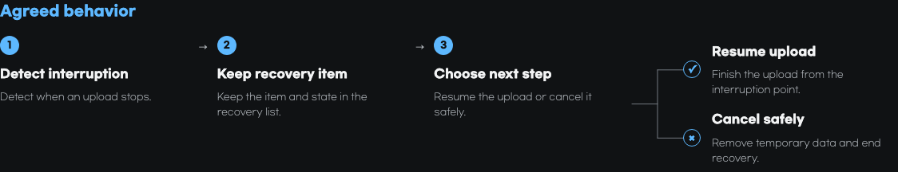

<p align="center">
  
</p>

<h1 align="center">Hope</h1>

<p align="center">
  <strong>
    Hope helps people work with AI while staying able to see, understand, and
    control the work.
  </strong>
</p>

<p align="center"><a href="README.ko.md">한국어</a></p>

<br>

## Features

### Align — Reach shared understanding before implementation and prevent `intent debt`

Align explains its understanding from verifiable evidence, such as the
codebase, and asks about choices that can change the result so the person and AI
can reach shared understanding.

When the agreement is ready, Align writes one self-contained HTML brief inside
the project.

The brief keeps the current intent prominent, records material changes as
revisions in the same file, and serves as the implementation contract.

For material UI work without attached reference material, Align uses web search
and presents two or three image mockups.

> [!NOTE]
> Hope recommends keeping the brief with the project but never stages it
> automatically.


| Agreed behavior · dark | Decisions and implementation choices · light |
| --- | --- |
| [](assets/readme/hope-align-behavior-en.png) | [](assets/readme/hope-align-decisions-en.png) |

---

### Diff — Understand what changed and how to judge it to prevent `cognitive debt`

A code change can be complete while its owner still cannot predict, explain, or
judge it, and that gap is cognitive debt.

Diff creates one HTML artifact that explains behavior before code and links
important claims to evidence.

It may use visuals, a microworld, or a quiz to help the reader explore the
change.

The artifact helps the reader understand and judge the change, then use that
understanding in follow-up decisions and work.

> [!NOTE]
> With no URL, Diff first looks for the current branch's pull request.
> If none exists, it selects your latest open pull request in the repository.
> Run Diff again when the pull request changes.

> [!NOTE]
> This is an actual Diff HTML artifact generated from
> [nanoid PR #601](https://github.com/ai/nanoid/pull/601).


| Core change | Behavior model |
| --- | --- |
| [](assets/readme/hope-diff-core-en.png) | [](assets/readme/hope-diff-behavior-en.png) |
| Teaching aid choices | Implementation details and evidence |
| [](assets/readme/hope-diff-teaching-en.png) | [](assets/readme/hope-diff-code-en.png) |
| Next check for an informed judgment | Evidence and checked scope |
| [](assets/readme/hope-diff-review-en.png) | [](assets/readme/hope-diff-evidence-en.png) |

---

### Toxic Review — Review a work product rigorously and critically

Toxic Review uses multiple independent subagents when a review needs to examine
distinct material risks.

The active agent judges which findings are supported.

Ask Hope to limit the reviewer count when you want a smaller run.

---

### Polish — Refine implemented work

Independent review agents look for useful improvements.

For code, they check reuse of existing helpers, simplicity, efficiency, and
abstraction fit.

A fresh finisher judges the results, applies only the improvements that work
together, and verifies the result.

Polish does not hunt for bugs, develop features, perform migrations, or handle
broad maintenance.

---

### Sweep — Clean up a codebase

Sweep performs a read-only review of a codebase.

It looks for broken references, stale code, unsupported abstractions,
verification gaps, dependency or license risk, delivery waste, unclear
ownership, and similar maintenance risks.

Select a candidate from the review results to start work.

---

### Write — Make language clearer without losing meaning

Hope also uses Write within other tasks, including implementation and other
Skills.

Write's shared standard adapts George Orwell's six rules in
[Politics and the English Language](https://www.orwellfoundation.com/the-orwell-foundation/orwell/essays-and-other-works/politics-and-the-english-language/).

<br>

## Install

You need:

- Node.js 22 or newer
- An authenticated [GitHub CLI](https://cli.github.com/) to use Diff. Run
  `gh auth login` first if needed.

The simplest option is to ask an AI:

```text
Install Hope from https://github.com/dkstm95/hope for this host.
Follow the repository README and tell me if I need to restart.
```

To install it yourself, run the commands for your host.

For example:

```bash
# Codex
codex plugin marketplace add dkstm95/hope
codex plugin add hope@hope
```

```bash
# Claude Code
claude plugin marketplace add dkstm95/hope
claude plugin install hope@hope
```

## License

[MIT](LICENSE)
