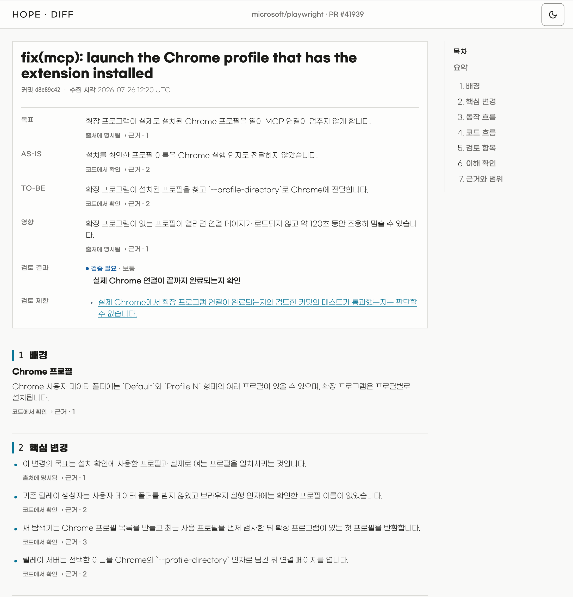
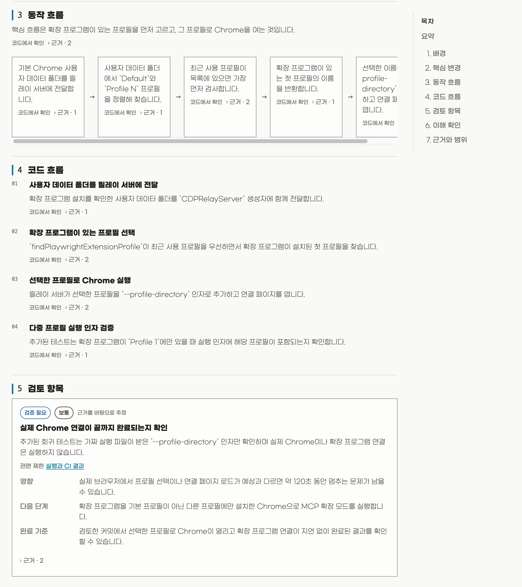

<p align="center">
  
</p>

<h1 align="center">Hope</h1>

<p align="center">
  <strong>
    Hope looks for practical ways for people and AI to work better together.
  </strong>
</p>

<p align="center"><a href="README.ko.md">한국어</a></p>

## Install

Install the Hope plugin in Codex or Claude Code. Hope requires Node.js 20 or
newer. Diff also requires an authenticated
[GitHub CLI](https://cli.github.com/). Run `gh auth login` first if needed.

The simplest option is to ask Codex or Claude Code:

```text
Install Hope from https://github.com/dkstm95/hope for this host.
Follow the repository README and tell me if I need to restart.
```

To install it yourself in Codex:

```bash
codex plugin marketplace add dkstm95/hope
codex plugin add hope@hope
```

To install it yourself in Claude Code:

```bash
claude plugin marketplace add dkstm95/hope
claude plugin install hope@hope
```

Start a new Codex or Claude Code session after installation.

## Features

### Diff

Diff helps you understand a `github.com` pull request at a specific commit. It
creates one local, self-contained HTML file.

<p align="center">
  
</p>

Use `$hope:diff` in Codex or `/hope:diff` in Claude Code. Add a GitHub pull
request URL when you want to choose the pull request yourself.

```text
$hope:diff https://github.com/owner/repository/pull/123
```

With no URL, run Hope inside the intended repository. Hope looks at open pull
requests created by the current GitHub user in that repository. It first
chooses one for the current branch. If none exists, it chooses the newest one.

Hope reads the pull request text, commit titles, and available text from changed
files. It does not inspect unchanged repository files, pull request discussions,
review comments, or CI results. It does not run tests, build or lint commands,
or other repository code.

The active Codex or Claude Code session processes the review under its host and
account policies. The finished HTML file is stored locally and works offline.
It records the commit shown in the file and does not update when the pull
request changes. Run Diff again after a change.

Diff provides explanations and evidence for your decision. It does not
recommend approval or rejection. It does not merge, change, or comment on the
pull request.

<p align="center">
  
</p>

### Settings

Settings lets you save one language and theme preference for every Hope path.

Use `$hope:settings` in Codex or `/hope:settings` in Claude Code to view,
change, or reset the preference.

Without a saved preference, Hope follows the current host or operating system
language and uses the system theme.

## License

[MIT](LICENSE)
