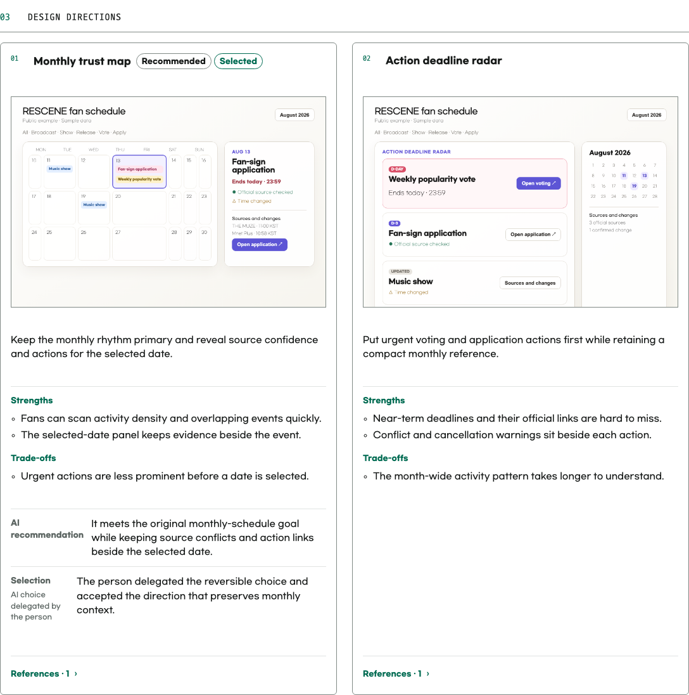
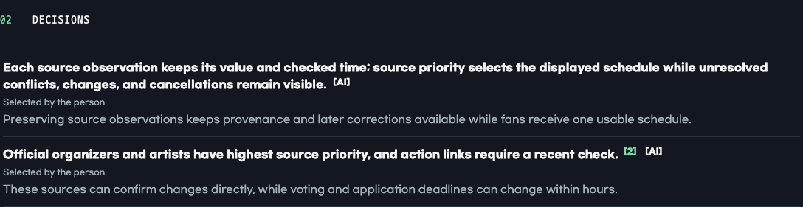
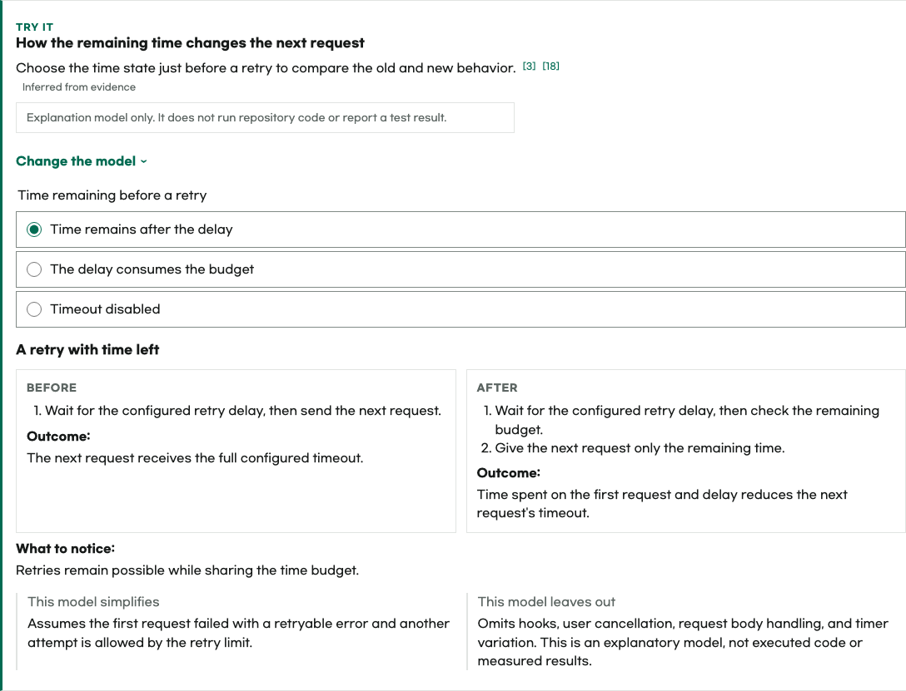
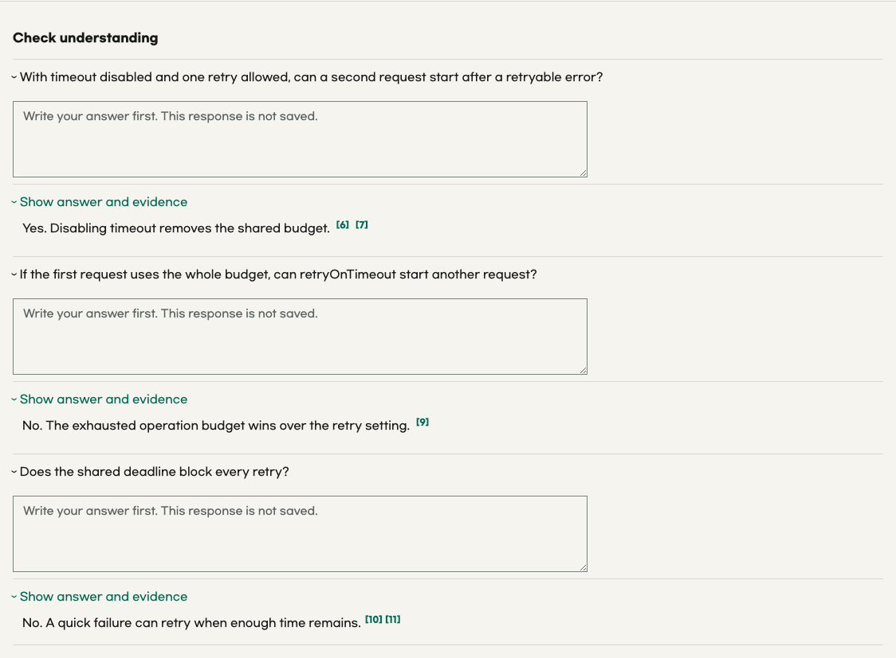
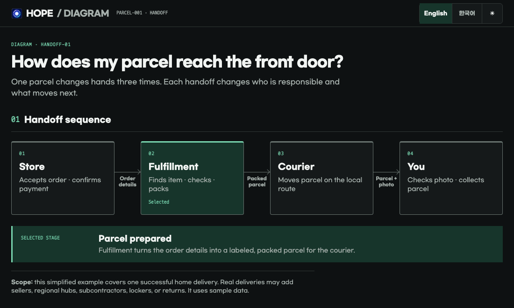

<p align="center">
  
</p>

<h1 align="center">Hope</h1>

<p align="center">
  <strong>
    Hope helps people work with AI while staying able to see, understand, and
    control the work.
  </strong>
</p>

<p align="center"><a href="README.ko.md">한국어</a></p>

<br>

## Features

### 🤝 Align — Share intent and consequential decisions before implementation

Align resolves choices that could materially change the result, using the
conversation and project evidence. The AI researches and recommends; the person
decides or delegates. Routine implementation details stay with implementation.

It confirms new shared understanding and continues under any implementation
authorization already given. An alignment-only request stops at the agreement.
When the agreement needs to survive the conversation, Align preserves it in one
self-contained project HTML record. Visual choices can use two or three image
options when comparison helps.

See [the Align Skill](plugins/hope/skills/align/SKILL.md) for the conversation
and artifact workflow.

> [!IMPORTANT]
> Generated Align records are project documentation. Later version-control work
> includes them with related project changes unless the person excludes them.

**Complete example HTML:** [Open the English Align record for a fan schedule that
makes source conflicts, changes, cancellations, and judgment responsibility
explicit.](docs/alignments/rescene-fan-calendar.en.html)

The captures below come from this example. It uses sample data solely as an
illustrative `rescene.fan` concept.


<details>
<summary>View detailed Align captures</summary>

| Light visual directions | Dark shared understanding and judgment markers |
| --- | --- |
| [](assets/readme/hope-align-directions-en.png) | [](assets/readme/hope-align-decisions-en.png) |

</details>

---

### 🔎 Diff — Understand code changes and discover what to do next

AI can produce a large code change quickly. Diff gives the engineer a compact
way to understand the resulting behavior, conditions, boundaries, and evidence.

Diff creates one HTML artifact that explains behavior before code and links
important claims to evidence.

It may use visuals, a microworld, or a quiz to help the reader explore the
change.

The artifact helps the reader build a working mental model of the change and
turn that understanding into follow-up questions, decisions, and work ideas.

> [!NOTE]
> With no URL, Diff first looks for the current branch's pull request.
> If none exists, it selects your latest open pull request in the repository.
> Run Diff again when the pull request changes.

The captures below come from a fixed English Diff example based on
[Ky PR #825](https://github.com/sindresorhus/ky/pull/825).

**Complete example HTML:** [Open the English Diff artifact for Ky PR #825 with
its timeout map, microworld, and quiz.](docs/diffs/ky-825-total-timeout.en.html)


<details>
<summary>View detailed Diff captures</summary>

| Light decision table | Dark interactive microworld |
| --- | --- |
| [](assets/readme/hope-diff-core-en.png) | [](assets/readme/hope-diff-microworld-en.png) |

[](assets/readme/hope-diff-quiz-en.png)

</details>

---

### ⚖️ Toxic Review — Put a work product through a rigorous Red–Blue review

Independent red reviewers challenge the work. Fresh blue reviewers verify
high-priority, consequential, or materially uncertain findings. The active
agent adjudicates the evidence and reports supported actions and limits.

See [the Toxic Review Skill](plugins/hope/skills/toxic-review/SKILL.md) for role
independence, verification criteria, and final judgment.

---

### 🧹 Sweep — Clean up a codebase

Explicitly invoke Sweep to apply proven, behavior-preserving cleanup across
the current repository or a named scope. It removes dead code, duplication,
needless work, and their obsolete support material while keeping public behavior
unchanged. Bugs, product decisions, and uncertain removals stay outside Sweep.

See [the Sweep Skill](plugins/hope/skills/sweep/SKILL.md) for scope and
verification.

---

### ◇ Diagram — Make relationships easier to see

Diagram creates, refines, or reviews explanatory diagrams and data charts when
position, connection, sequence, hierarchy, state, or quantitative shape
communicates more clearly than prose or a small table.

It works on its own or inside an existing task, preserving that task's evidence
and artifact contract. See [the Diagram Skill](plugins/hope/skills/diagram/SKILL.md)
for composition, accessibility, and rendered verification.

**Complete example HTML:** [Open the parcel-handoff visualization created by
Diagram.](docs/visualizations/parcel-handoff.html)



The design standard is adapted from Cathryn Lavery's
[Diagram Design](https://github.com/cathrynlavery/diagram-design) under the MIT
License. Hope includes the required
[upstream notice](plugins/hope/skills/diagram/LICENSE.diagram-design), but not
Diagram Design's templates, scripts, fonts, gallery, or third-party icons.

---

### ✍️ Write — Make language clearer without losing meaning

Hope also uses Write within other tasks, including implementation and other
Skills.

Write's shared standard adapts George Orwell's six rules in
[Politics and the English Language](https://www.orwellfoundation.com/the-orwell-foundation/orwell/essays-and-other-works/politics-and-the-english-language/).

<br>

## Install

You need:

- Node.js 22 or newer
- An authenticated [GitHub CLI](https://cli.github.com/) to use Diff. Run
  `gh auth login` first if needed.

> [!TIP]
> The simplest option is to ask an AI:
>
> ```text
> Install Hope from https://github.com/dkstm95/hope for this host.
> Follow the repository README and tell me if I need to restart.
> ```

To install it yourself, run the commands for your host.

For example:

```bash
# Codex
codex plugin marketplace add dkstm95/hope
codex plugin add hope@hope
```

```bash
# Claude Code
claude plugin marketplace add dkstm95/hope
claude plugin install hope@hope
```

## License

[MIT](LICENSE)

Diagram also carries the
[Diagram Design MIT notice](plugins/hope/skills/diagram/LICENSE.diagram-design)
for its adapted design guidance.
