<p align="center">
  
</p>

<h1 align="center">Hope</h1>

<p align="center">
  <strong>
    Hope helps people work with AI while staying able to see, understand, and
    control the work.
  </strong>
</p>

<p align="center"><a href="README.ko.md">한국어</a></p>

AI can finish a task quickly without making its decisions, evidence, or
remaining uncertainty clear to the person responsible for it.

Hope provides a focused tool for each of those moments.

Use Hope to align before implementation, challenge a work product, understand a
code change, refine completed work, or clarify language without losing meaning.

## Start with your problem

| If this sounds familiar… | Use | Hope helps you… |
| --- | --- | --- |
| “The AI and I may not understand this task the same way.” | **Align** | Find material misunderstandings and make the current shared understanding visible before implementation |
| “This looks convincing, but I may be missing an important problem.” | **Toxic Review** | Challenge the work with relevant perspectives and return one evidence-based result |
| “AI changed the code, but I cannot explain what changed or judge it yet.” | **Diff** | Understand one exact change, make an informed judgment, and carry that understanding into later work |
| “The work is complete, but it needs refinement without changing settled behavior or meaning.” | **Polish** | Refine it once within explicit preservation conditions and a stated verification scope |
| “This language needs to be clearer without losing meaning, facts, uncertainty, citations, or voice.” | **Write** | Draft, edit, or review prose with one shared writing standard |

## Install

Install the Hope plugin in Codex or Claude Code.

You need:

- Node.js 20 or newer
- An authenticated [GitHub CLI](https://cli.github.com/) to use Diff. Run
  `gh auth login` first if needed.

The simplest option is to ask an AI:

```text
Install Hope from https://github.com/dkstm95/hope for this host.
Follow the repository README and tell me if I need to restart.
```

To install it yourself, run the commands for your host.

```bash
# Codex
codex plugin marketplace add dkstm95/hope
codex plugin add hope@hope
```

```bash
# Claude Code
claude plugin marketplace add dkstm95/hope
claude plugin install hope@hope
```

Start a new Codex or Claude Code session after installation.

## Features

### Align

> “The AI and I may not understand this task the same way.”

Misunderstandings about a task's goal, scope, behavior, or important choices can
survive until implementation.

Align reads available evidence, asks risk-adaptive questions, and keeps facts,
decisions, proposals, assumptions, and open questions distinct.

It renders the current shared understanding as one self-contained HTML artifact
with the scope, success conditions, scenarios, and verifiable work.

Align waits for explicit approval and never implements the task.

> Example: “Help us settle the upload recovery behavior before implementation.”

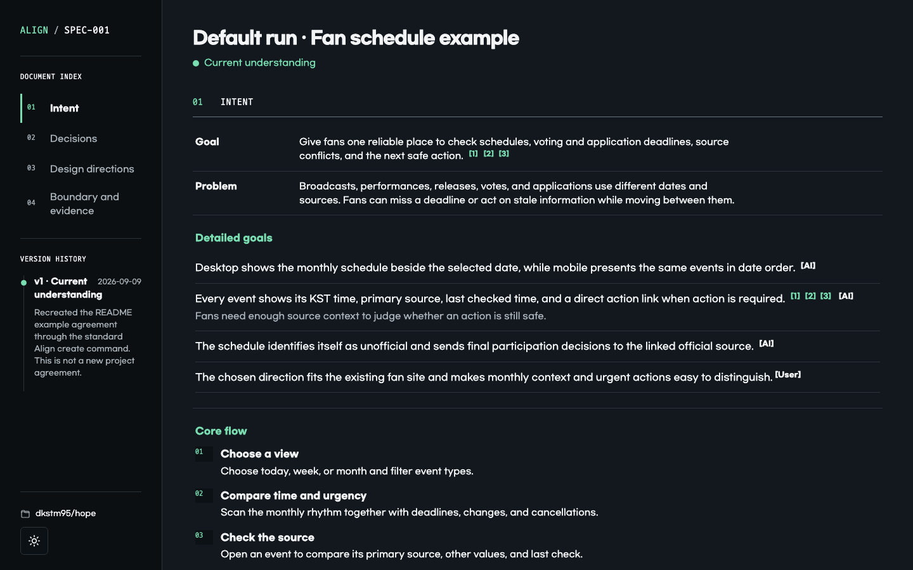

*An actual Align HTML artifact generated from a failed-upload recovery example.*

| Scope and success | Expected behavior |
| --- | --- |
| [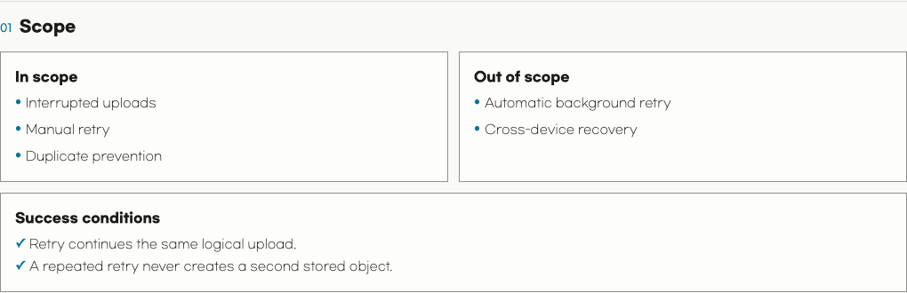](assets/readme/hope-align-scope-en.png) | [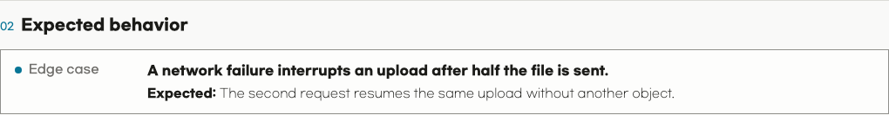](assets/readme/hope-align-scenarios-en.png) |
| Shared understanding and next decision | Verifiable work |
| [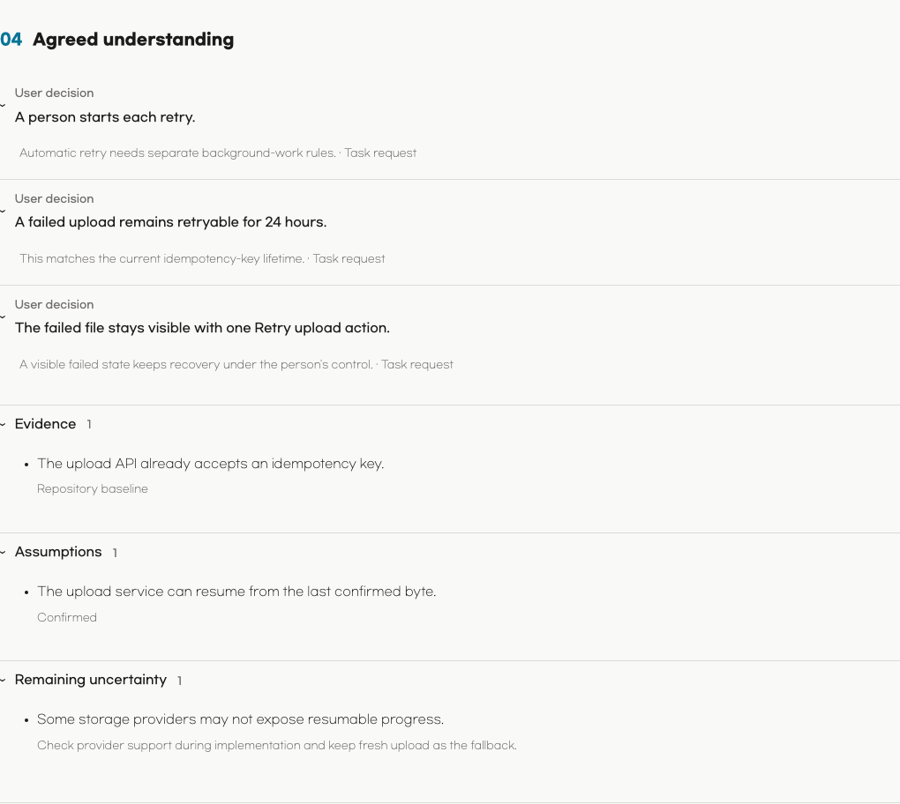](assets/readme/hope-align-understanding-en.png) | [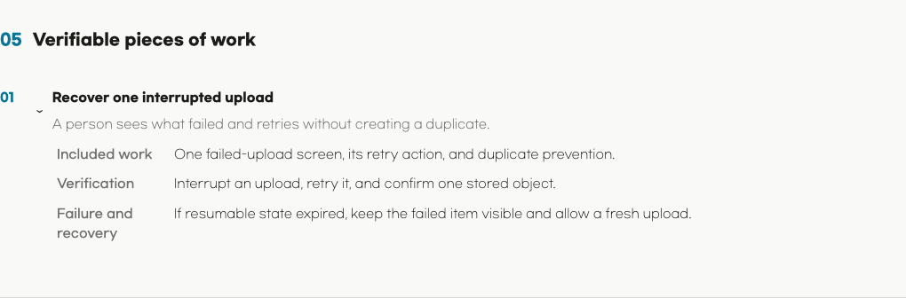](assets/readme/hope-align-work-en.png) |

---

### Toxic Review

> “This looks convincing, but I may be missing an important problem.”

Convincing work can still hide material problems, unsupported claims, or
needless complexity.

Toxic Review selects only the perspectives that fit the target and risk.

It turns evidence-linked findings into one prioritized review rather than a
collection of reviewer voices.

It is hard on the work, respectful toward people, and does not invent criticism.

Finding no material issue is valid.

> Example: “Find the material risks in this migration plan.”

---

### Diff

> “AI changed the code, but I cannot explain what changed or judge it yet.”

A code change can be complete while its owner still cannot predict, explain, or
judge it.

That gap is cognitive debt.

Diff binds its explanation to one exact GitHub pull request snapshot, explains
behavior before code, and links important claims to evidence.

When active exploration would help, the review can use visuals, a microworld, or
an evidence-backed quiz.

The resulting local HTML file helps the reader understand the change, judge it,
and carry that understanding into follow-up decisions and work.

Diff does not recommend approval or rejection, change the pull request, inspect
discussions or CI results, or run repository code.

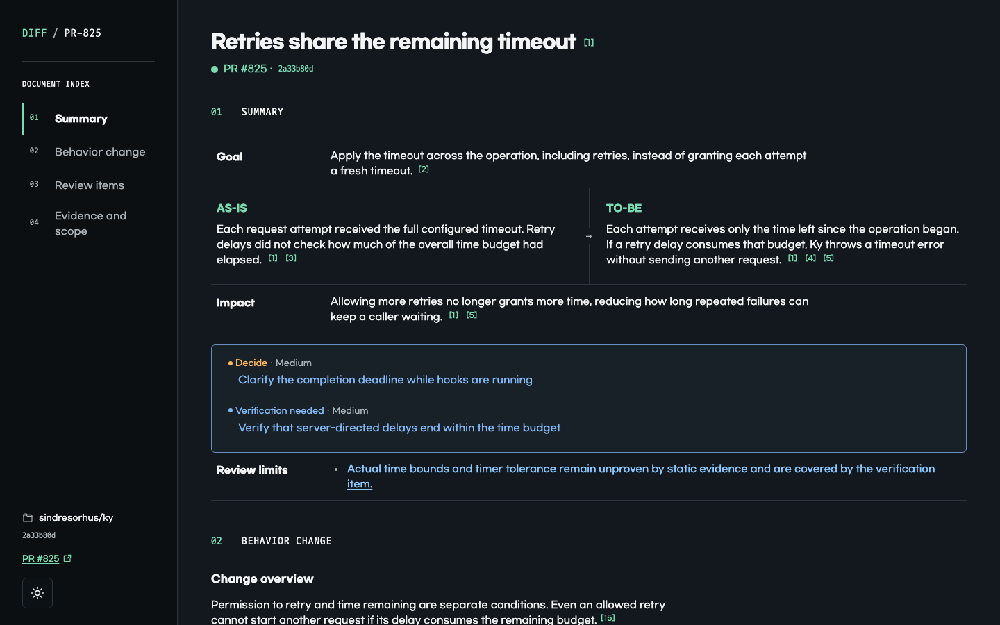

*An actual Diff HTML artifact generated from [nanoid PR #601](https://github.com/ai/nanoid/pull/601).*

| Core change | Behavior model |
| --- | --- |
| [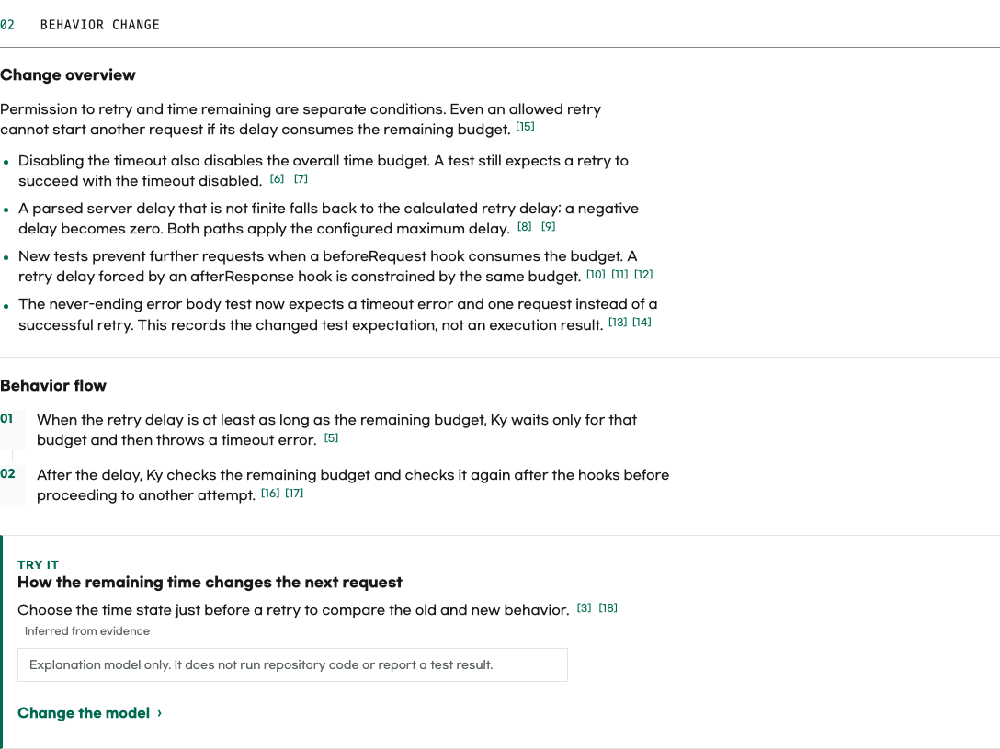](assets/readme/hope-diff-core-en.png) | [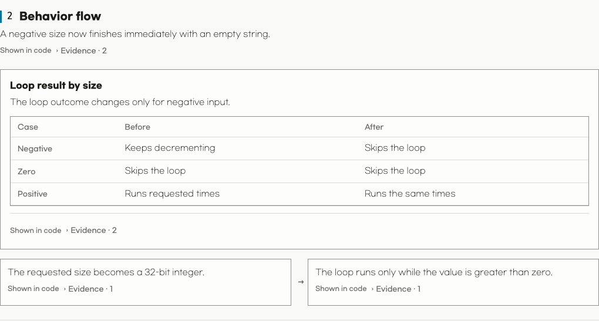](assets/readme/hope-diff-behavior-en.png) |
| Teaching aid choices | Evidence-linked code flow |
| [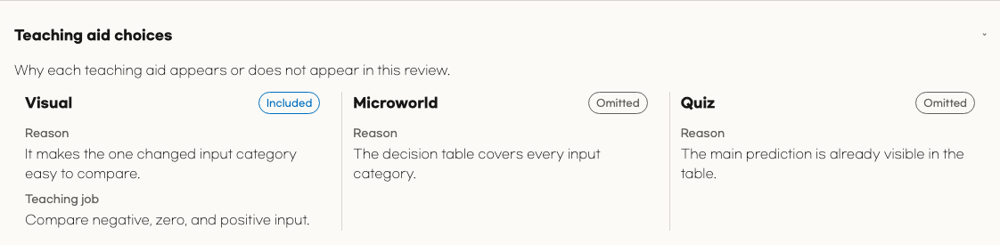](assets/readme/hope-diff-teaching-en.png) | [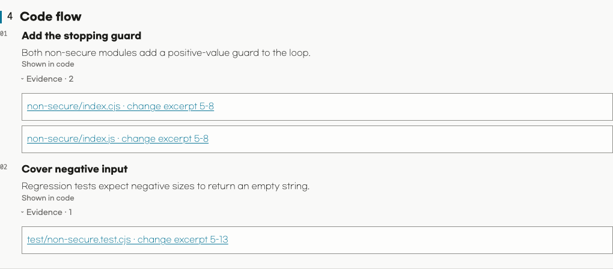](assets/readme/hope-diff-code-en.png) |
| Next check for an informed judgment | Evidence and checked scope |
| [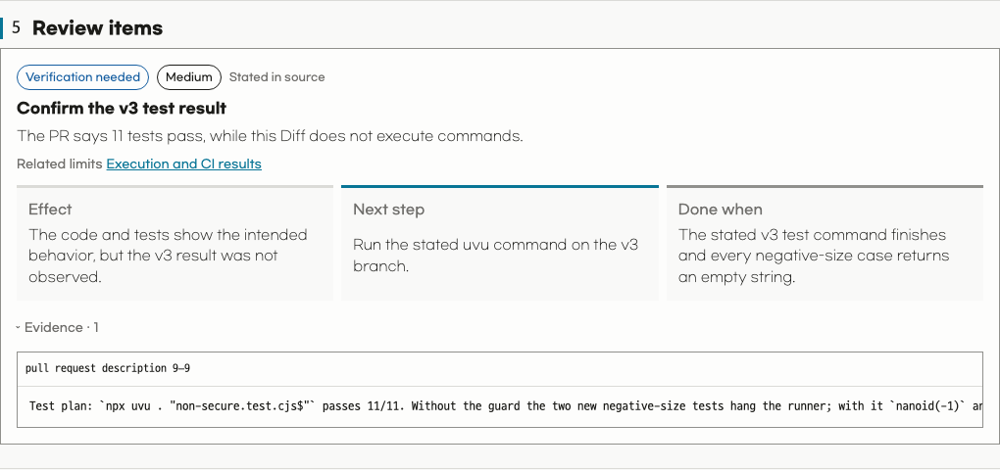](assets/readme/hope-diff-review-en.png) | [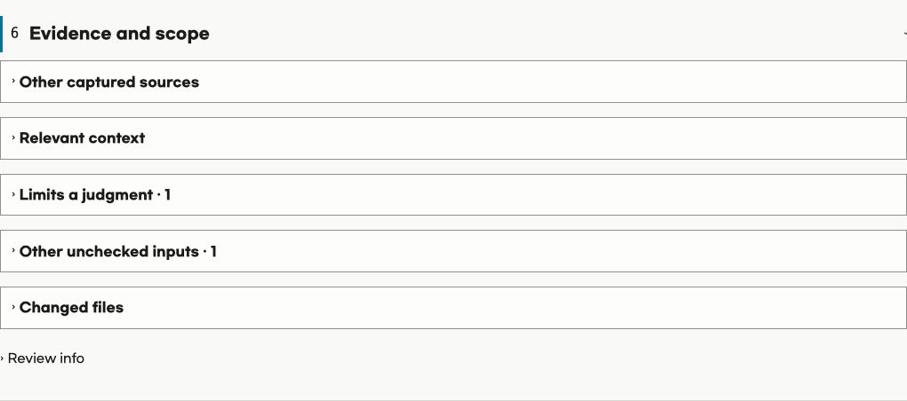](assets/readme/hope-diff-evidence-en.png) |

With no URL, Diff selects the current branch's pull request or your latest open
pull request in the repository.

Run Diff again when the pull request changes.

---

### Polish

> “The work is complete, but I want to refine it without changing what we already settled.”

Refinement can quietly become a behavior change, a new requirement, or a matter
of taste.

Polish defines what must stay unchanged and refines the work once within a clear
scope.

It preserves settled behavior and meaning, reports what changed and what was
checked, and stops when the work needs a material decision.

> Example: “Shorten this completed guideline without changing its requirement.”

---

### Write

> “Make this clearer without changing what it means or inventing what we do not know.”

A smoother sentence is still wrong if it loses a fact, removes uncertainty,
changes a citation, or replaces the person's voice.

Write's shared standard adapts George Orwell's six rules in
[Politics and the English Language](https://www.orwellfoundation.com/the-orwell-foundation/orwell/essays-and-other-works/politics-and-the-english-language/):

- avoid stale metaphors and stock phrases;
- prefer short, familiar words;
- remove words that add no meaning;
- use active voice when it makes the actor and action clearer;
- replace jargon with everyday language when possible; and
- break any rule that would make the writing inaccurate, unclear, unnatural, or
  needlessly harsh.

Hope also leads with the result, keeps one main idea in each sentence, and
preserves meaning, facts, uncertainty, citations, numbers, and voice.

Hope prefers one sentence per prose paragraph when it improves meaning,
readability, or rhythm.

In Markdown and plain text, one blank line separates paragraphs, while other
formats use their native paragraph structure.

Write chooses semantic structure, and the renderer controls visible spacing,
typography, and styling.

Related sentences stay together when splitting them would harm meaning, flow,
or voice, or conflict with the target format.

Each language must read like original prose rather than copying another
language's word order and idiom.

Write can draft, edit, or review language.

Use Polish when a completed work product also needs structural refinement.

> Example: “Make this save error clear without inventing a cause.”

---

### Settings

> “I do not want to choose the same language and theme for every result.”

Settings stores a supported locale and initial `system`, `light`, or `dark`
theme as shared defaults for the harness and installed plugin.

Changes affect new artifacts only.

## License

[MIT](LICENSE)
