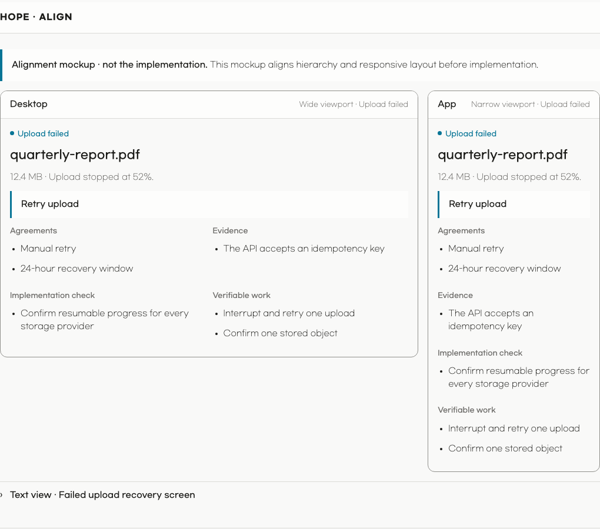

<p align="center">
  
</p>

<h1 align="center">Hope</h1>

<p align="center">
  <strong>
    Hope helps people work with AI while staying able to see, understand, and
    control the work.
  </strong>
</p>

<p align="center">
  <a href="#install"></a>
  <a href="#install"></a>
</p>

<p align="center"><a href="README.ko.md">한국어</a></p>

AI can finish a task quickly without making its decisions, evidence, or
remaining uncertainty clear to the person responsible for it.

Hope provides a focused tool for each of those moments.

Use Hope to align before implementation, challenge a work product, understand a
code change, sweep codebase maintenance, refine completed work, or clarify
language without losing meaning.

## Install

Install the Hope plugin in Codex or Claude Code.

You need:

- Node.js 20 or newer
- An authenticated [GitHub CLI](https://cli.github.com/) to use Diff. Run
  `gh auth login` first if needed.

The simplest option is to ask an AI:

```text
Install Hope from https://github.com/dkstm95/hope for this host.
Follow the repository README and tell me if I need to restart.
```

To install it yourself, run the commands for your host.

```bash
# Codex
codex plugin marketplace add dkstm95/hope
codex plugin add hope@hope
```

```bash
# Claude Code
claude plugin marketplace add dkstm95/hope
claude plugin install hope@hope
```

Start a new Codex or Claude Code session after installation.

### Keep Hope current

- **Claude Code:** enable auto-update for the Hope marketplace under `/plugin`
  → **Marketplaces**. Run `/reload-plugins` when Claude Code reports an update.
- **Codex:** run `codex plugin marketplace upgrade hope`, then
  `codex plugin add hope@hope`, and start a new session.

## Features

Choose the work you need.

<details>
<summary><strong>Align</strong> — Reach shared understanding before implementation</summary>

Misunderstandings about a task's goal, scope, behavior, or important choices can
survive until implementation.

Align reads available evidence, asks risk-adaptive questions, and keeps facts,
decisions, proposals, assumptions, and open questions distinct.

It renders one decision-centered HTML artifact with the goal, next action, and
up to three primary agreements on the first screen.

Supporting evidence and work details stay available without crowding the main
reading path.

When a task changes a user interface, Align compares wide and narrow previews
from the same canonical screen content before implementation.

> [!NOTE]
> Align waits for explicit approval and never implements the task.

> Example: “I want to add a failed-upload recovery screen. Help me clarify the
> retry behavior and layout before implementation.”


*An actual Align HTML artifact for a failed-upload recovery screen.*

| Scope and success | Responsive preview |
| --- | --- |
| [](assets/readme/hope-align-scope-en.png) | [](assets/readme/hope-align-preview-en.png) |
| Agreements and supporting detail | Verifiable work |
| [](assets/readme/hope-align-understanding-en.png) | [](assets/readme/hope-align-work-en.png) |

</details>

<details>
<summary><strong>Diff</strong> — Understand what changed and how to judge it</summary>

A code change can be complete while its owner still cannot predict, explain, or
judge it, and that gap is cognitive debt.

Diff explains behavior before code and links important claims to evidence.

When active exploration would help, the review can use visuals, a microworld, or
an evidence-backed quiz.

The resulting local HTML file helps the reader understand the change, judge it,
and carry that understanding into follow-up decisions and work.

> [!NOTE]
> Diff does not recommend approval or rejection or change the pull request.
> It does not inspect discussions or CI results or run tests, builds, linters,
> or repository code.


*An actual Diff HTML artifact generated from [nanoid PR #601](https://github.com/ai/nanoid/pull/601).*

| Core change | Behavior model |
| --- | --- |
| [](assets/readme/hope-diff-core-en.png) | [](assets/readme/hope-diff-behavior-en.png) |
| Teaching aid choices | Evidence-linked code flow |
| [](assets/readme/hope-diff-teaching-en.png) | [](assets/readme/hope-diff-code-en.png) |
| Next check for an informed judgment | Evidence and checked scope |
| [](assets/readme/hope-diff-review-en.png) | [](assets/readme/hope-diff-evidence-en.png) |

> [!NOTE]
> With no URL, Diff first looks for the current branch's pull request.
> If none exists, it selects your latest open pull request in the repository.
> Run Diff again when the pull request changes.

</details>

<details>
<summary><strong>Toxic Review</strong> — Find important risks you may have missed</summary>

Toxic Review turns evidence-linked findings into one prioritized review.

It is hard on the work, respectful toward people, and does not invent criticism.

> [!NOTE]
> Toxic Review uses one reviewer when a focused pass is enough and may run
> multiple independent reviewers for distinct material risks.
>
> Multi-reviewer runs make a separate model call for each reviewer, so parallel
> execution can reduce elapsed time but not token usage.
>
> Ask Hope to limit the reviewer count when you want a smaller run.

> Example: “Review this database migration plan.”

</details>

<details>
<summary><strong>Polish</strong> — Refine completed work without changing settled decisions</summary>

Polish defines what must stay unchanged and refines the work once within a clear
scope.

It preserves settled behavior and meaning, reports what changed and what was
checked, and stops when the work needs a material decision.

> Example: “Refine the current work product.”

</details>

<details>
<summary><strong>Sweep</strong> — Clean up and maintain a codebase safely</summary>

Sweep runs one codebase maintenance task that adapts to the codebase instead of
using schedule-based profiles.

It inspects an exact snapshot and shows a bounded plan before changing files.

It checks broken references and configuration drift; dead or stale code, tests,
documentation, and configuration; repeated, missing, or premature abstractions;
test and documentation gaps; dependency, security, license, and compatibility
risks; performance, package, build, and CI waste; and architecture, support,
release, and recovery readiness.

Incomplete evidence stays visible instead of being reported as complete.

Sweep applies only approved behavior-preserving work and hands behavior,
public-contract, or dependency changes to a separate implementation task.

> Example: “Sweep this codebase.”

</details>

<details>
<summary><strong>Write</strong> — Make language clearer without losing meaning</summary>

Write drafts, edits, or reviews language without losing meaning, facts,
uncertainty, citations, or the person's voice.

Hope also applies Write in other tasks, including prompts, documentation,
responses, interface text, errors, comments, and names.

Write's shared standard adapts George Orwell's six rules in
[Politics and the English Language](https://www.orwellfoundation.com/the-orwell-foundation/orwell/essays-and-other-works/politics-and-the-english-language/).

> Example: “Make this incident update easier to understand.”

</details>

<details>
<summary><strong>Settings</strong> — Set Hope's language and theme</summary>

Settings stores a supported locale and initial `system`, `light`, or `dark`
theme as shared defaults.

The harness and installed plugin share these settings, and changes affect new
artifacts only.

</details>

## License

[MIT](LICENSE)
