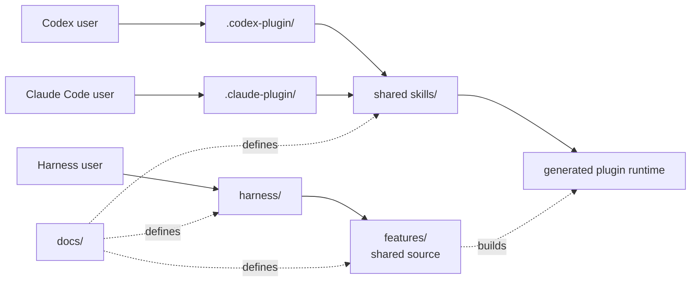

# Hope architecture

Hope has two entry paths into the same feature code: an independent harness and
host plugins or skills. The shared Claude and Codex skill provides the first
complete diff path. The harness already owns the same non-model boundaries, but
reports that its AI adapter is not available yet.

[PRINCIPLES.md](../PRINCIPLES.md) defines the project direction.
[diff.md](diff.md) defines Hope diff.
[write.md](write.md) defines Hope write.
[design.md](design.md) defines the shared visual language.

## Two tracks



The harness runs without a plugin or AI host. A skill is a thin host adapter.
It may add instructions for an AI, but it does not own feature behavior.

The dependency direction is:

```text
harness -> features <- host adapters
```

Feature code never imports a skill, plugin manifest, or host adapter.

## Folders

```text
hope/
├── .claude-plugin/     Claude Code marketplace catalog
├── design/             Shared visual tokens and fixed assets
├── docs/               Shared product definitions
├── features/           Feature code used by every entry path
├── harness/            Independent Hope commands
├── locales/            Shared fixed interface text
├── plugins/hope/       Codex and Claude Code package
├── settings/           Shared user preference code
├── test/               Behavior and boundary tests
└── tools/              Project checks
```

Root `docs/`, `features/`, `settings/`, `locales/`, and `design/` are editable
sources. Both hosts install `plugins/hope/` as one package directory, so the
plugin contains generated copies of those sources. `tools/build-plugin.mjs`
creates the copies. The release check requires each copy to match its source.
Never edit a generated copy by hand. The package includes every Hope file it
uses, but its JavaScript commands still require Node.js 20 or newer.

The root harness loads syntax-highlighting dependencies from the locked Node
package graph. The plugin build bundles the fixed highlighter, GitHub light and
dark code themes, and supported language grammars into its generated runtime.
The installed Claude or Codex plugin therefore does not depend on a separate
`node_modules` directory or a network request.

`tools/plugin-package-files.txt` is the explicit release boundary. The release
copies only those files into a new staging directory before creating the zip.
An unrelated or temporary file under `plugins/hope/` cannot enter a release by
accident.

The package has two host manifests:

```text
plugins/hope/
├── .codex-plugin/plugin.json
├── .claude-plugin/plugin.json
├── skills/diff/SKILL.md
├── skills/settings/SKILL.md
├── skills/write/SKILL.md
├── docs/                  generated product definitions
└── runtime/               generated feature code
```

The manifests are host adapters. They do not define feature behavior. The
shared skill may explain how each host locates the package, but it must reach
the same generated command.

## Current diff boundary

The current diff implementation starts from [diff.md](diff.md). It collects an
exact GitHub pull-request snapshot, exposes bounded inspection pages, validates
one structured analysis, rechecks the snapshot, and publishes one private
self-contained HTML file without replacing an existing file.

After the first inspection, the skill can ask the shared runtime for a limited
set of grounded files at the captured head or merge-base revision. The runtime
adds those context sources through an atomic replacement inspection plan. This
prevents the analysis from mixing page generations.

The Claude and Codex skill is the first complete AI analysis path. It can use
the active host session to produce a structured analysis. The harness shares
settings, collection, validation, rendering, and lifecycle code. It must not
claim automatic AI analysis until it has a real model adapter of its own. These
are two honest entry boundaries to one feature implementation, not separate
diff implementations.

The skill carries only compact authoring rules and points to the generated
analysis schema. It does not load the full human-facing product and design
documents for every review. Those documents remain the source of truth for
implementation and maintenance; the runtime validator and renderer own their
fixed behavior.

## Current write boundary

The write implementation starts from [write.md](write.md). The editable writing
standard lives only in `features/write/standard.md`. The feature core returns
the standard with a `draft`, `edit`, or `review` response contract.

The Claude and Codex Skill chooses a mode and asks the generated runtime for the
same brief. It does not carry another copy of the writing rules. The independent
harness routes `hope write` to the same feature. Automatic writing reports that
its model adapter is unavailable until the harness has one.

## Add a feature

1. Start with a clear user goal.
2. Put shared behavior in `features/<name>`.
3. Expose it through `harness/`.
4. Add a thin skill only when an AI host needs one.
5. Add shared helpers only after two real features need the same rule.

Do not call a feature complete because its Skill or plugin manifest validates.
Require a test that proves every supported entry path reaches the same core
boundary.

Use names that describe the work or data. Do not add a generic runner,
manager, engine, registry, or base class without a concrete second use.
