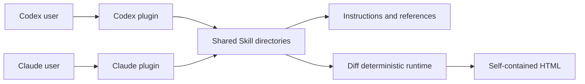

# Hope architecture

Hope is one plugin package for Codex and Claude.

The package contains focused Skills and the deterministic runtime needed by
Hope Diff.

There is no independent Hope CLI or harness.

## Product definitions

- [PRINCIPLES.md](../PRINCIPLES.md) defines the project direction.
- [align.md](align.md) defines Hope Align.
- [diff.md](diff.md) defines Hope Diff.
- [polish.md](polish.md) defines Hope Polish.
- [sweep.md](sweep.md) defines Hope Sweep.
- [toxic-review.md](toxic-review.md) defines Hope Toxic Review.
- [write.md](write.md) defines Hope Write.
- [design.md](design.md) defines the visual language used by Diff HTML.
- [release.md](release.md) defines the public package boundary.

## One package, two kinds of feature



Most Hope features are instruction-led.

Their behavior lives in a concise `SKILL.md` and optional references.

The active host inspects evidence, makes model judgments, uses its normal tools,
and speaks with the person.

Diff also needs deterministic code.

That code captures an exact pull-request snapshot, bounds evidence, validates
citations, renders offline HTML, rechecks the source, and publishes without
overwriting an existing file.

## Folders

```text
hope/
├── .agents/             Codex local marketplace catalog
├── .claude-plugin/      Claude local marketplace catalog
├── assets/              Brand sources and README captures
├── design/              Diff design tokens and fixed fonts
├── docs/                Product and architecture definitions
├── e2e/                 Diff browser acceptance tests
├── entrypoint/          Direct script entry detection
├── features/
│   └── diff/            Diff runtime, bounded input, and safe publication
│       └── locales/     Fixed Diff interface text
├── plugins/hope/        Installable Codex and Claude package
├── test/                Deterministic and package tests
└── tools/               Build, validation, staging, and release scripts
```

`plugins/hope/skills/` is the editable source for every Skill.

Do not generate Skill instructions from JavaScript.

`features/diff/`, `design/`, and `entrypoint/` are editable sources for the
packaged Diff runtime.

`features/diff/locales/` contains fixed interface text used only by Diff.

Diff-only helpers stay inside `features/diff/` instead of presenting themselves
as shared feature infrastructure.

`tools/build-plugin.mjs` generates `plugins/hope/docs/`,
`plugins/hope/LICENSE`, `plugins/hope/THIRD_PARTY_NOTICES.md`, and
`plugins/hope/runtime/`.

`tools/plugin-files.mjs` maps every generated file to its editable source and
derives the exact package list.

Generated JavaScript and product-document Markdown carry a visible source
banner.

Markdown copied as a raw notice or source record does not:
`THIRD_PARTY_NOTICES.md` and `design/fonts/SOURCE.md` keep their recorded
content unchanged.

License text, schemas, and locale dictionaries are also copied without
banners.

Do not edit generated plugin files by hand.

## Plugin package

```text
plugins/hope/
├── .codex-plugin/plugin.json
├── .claude-plugin/plugin.json
├── assets/
├── runtime/                 Generated deterministic Diff code
└── skills/
    ├── align/
    │   └── SKILL.md
    ├── diff/
    │   ├── SKILL.md
    │   ├── references/
    │   └── assets/
    ├── polish/
    │   └── SKILL.md
    ├── sweep/
    │   └── SKILL.md
    ├── toxic-review/
    │   ├── SKILL.md
    │   └── references/
    └── write/
        ├── SKILL.md
        └── references/
```

Both host manifests point at the same `skills/` directory.

Host-specific metadata may describe discovery, but it must not define different
feature behavior.

Hope has no Settings Skill.

The active conversation supplies language and presentation preferences.

Hope has no product or release Model Evaluation framework.

Instruction-led Skill behavior is exercised manually with representative
prompts and normal product use.

## Skill boundary

A Skill owns:

- when it should activate;
- the user's goal and supported scope;
- the model's decision and conversation rules;
- stopping and approval boundaries;
- references that are needed only in some runs; and
- how to use a deterministic script, when one exists.

A Skill does not need a schema merely to prove that the same model filled in a
structured record correctly.

Use a schema or script when another process consumes the result or when code
must independently enforce a boundary.

Keep the selected `SKILL.md` short.

Move detailed analysis methods, writing standards, and rare procedures into
`references/`.

## Align boundary

Align finds material misunderstandings before implementation.

The host inspects available project evidence, teaches back its current
understanding, and asks only about intent, preference, work rules, or a material
choice.

Align keeps repository facts, user decisions, AI proposals, assumptions, open
questions, and uncertainty distinct in the conversation.

It proposes implementation only after no material blocker remains.

It waits for explicit user approval.

Align does not create HTML, persist a session record, invoke Polish, or implement
the task.

## Polish boundary

Polish performs one bounded cleanup or refactor of a named completed work
product.

It inspects the exact target, states a short preservation contract, makes at
most one revision round, and verifies the checked scope.

It stops when a material product choice is required.

A no-change result is valid.

Polish uses the active host's normal file tools and does not create a private
runtime record.

## Sweep boundary

Sweep is read-only.

It inventories the project, discloses exclusions and gaps, reports evidence,
and proposes an ordered maintenance plan.

It does not edit files, create approval records, invoke Polish, or claim complete
coverage when inspection was partial.

The person may select a candidate and start a separate implementation task.

## Toxic Review boundary

Toxic Review is strict about the work and respectful toward people.

The active host chooses the smallest useful reviewer role set.

Use fresh subagent contexts for distinct roles when the host supports them.

One focused review is valid when additional roles would repeat evidence.

The active host adjudicates findings by evidence and impact rather than reviewer
votes.

No finding is a valid result.

Detailed causal-review guidance lives in a conditional reference.

Toxic Review does not use a custom model adapter or persist a role-run state
machine.

## Write boundary

Write drafts, edits, or reviews language while preserving meaning, facts,
uncertainty, citations, exact text, and intended voice.

Its writing standard is a reference shared by project instructions and the
Write Skill.

Other Skills may apply that standard without invoking Write as a second feature.

## Diff boundary

Diff explains one exact GitHub pull request and publishes a private,
self-contained HTML review.

The Skill confirms the requested scope and target.

The deterministic path then:

1. resolves one pull request;
2. captures its base, head, merge base, files, patches, and bounded context;
3. exposes stable source IDs to the active host;
4. validates analysis references against the captured sources;
5. renders one offline HTML file with escaped authored content;
6. rechecks the pull-request revisions before publication; and
7. creates a new output file without replacing an existing one.

The active host owns review judgment and prose.

The runtime owns source identity, input bounds, deterministic rendering, and
safe publication.

The Diff analysis reference owns teaching-aid selection and authoring rules.

For teaching aids, the runtime keeps only the enums, validation and metrics,
fixed limits, and bounded microworld skeleton logic.

Private working state is temporary and belongs to one run.

Hope removes it after success or cancellation when ownership is certain.

Large pull requests may stop with a clear size or context limit.

Hope does not need resumable multi-generation evaluation machinery merely to
avoid reporting that limit.

## Generated runtime

The installed plugin cannot depend on a repository `node_modules/` directory
or a network request while rendering.

The build copies fixed fonts and deterministic Diff modules into
`plugins/hope/runtime/`.

Code evidence uses escaped text and fixed patch-line roles, so rendering does
not need a language grammar bundle.

`tools/plugin-package-files.txt` is the exact release allowlist.

An unrelated file under `plugins/hope/` cannot enter a release accidentally.

## Tests

Tests follow the supported boundaries.

- Skill tests check metadata and reference packaging.
- Node tests cover Diff parsing, snapshots, citations, rendering, stale-source
  checks, bounded input, and safe publication.
- Browser tests cover Diff layout, keyboard behavior, accessibility, responsive
  navigation, no-JavaScript behavior, and print.
- Package tests compare generated runtime files with their editable sources and
  verify the exact release allowlist.

There are no harness-parity, Settings, Model Evaluation, Align renderer, or
legacy-record tests.

Linux runs the full deterministic suite on Node.js 22 and 24.

macOS and Windows run focused Node.js 22 installation and path smoke tests.

Representative-prompt checks for instruction-led Skills are development and
product smoke, not an automated release or model-evaluation gate.

## Add a feature

1. Start with a clear user goal.
2. Define the product behavior under `docs/`.
3. Create one concise Skill.
4. Add a reference only for conditional detail.
5. Add a script only for a deterministic or external-state boundary.
6. Test discovery and the remaining deterministic promises.

Do not add a generic runner, manager, engine, registry, shared state machine, or
compatibility layer without a concrete second use and a documented product
need.
