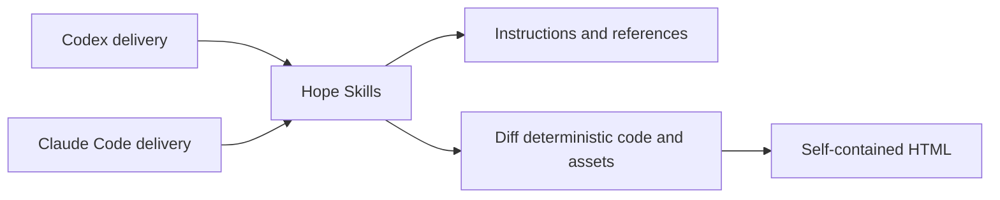

# Hope architecture

Hope is a set of focused features for working with AI.

This repository currently distributes those features as one plugin for Codex
and Claude Code.

Delivery exposes Hope but does not define feature behavior.

There is no independent Hope CLI or harness.

## Sources of truth

- [PRINCIPLES.md](../PRINCIPLES.md) defines the project direction.
- Each `plugins/hope/skills/<feature>/SKILL.md` defines one feature's behavior.
- A Skill's `references/` directory owns detailed or conditional guidance.
- [design.md](design.md) defines the Diff artifact's information structure and
  visual language.
- [release.md](release.md) defines the public package and release process.
- This document defines repository structure and dependency boundaries.

The `docs/` directory is for contracts that cross feature boundaries or govern
the repository.

It must not contain another description of behavior already owned by a Skill.

A separate audience is not enough reason to keep parallel behavior text.

Link to the authoritative source unless another document owns a distinct
contract or obligation.

## Dependency direction



The arrows point from delivery toward feature behavior.

Manifests and marketplace metadata may describe discovery but must not define a
different feature.

Feature references and scripts must not read a plugin manifest, marketplace
configuration, installed-cache path, or host-specific root variable.

Keep host-specific path resolution in `SKILL.md` or repository tooling.

Use delivery-neutral language for feature judgment and workflow rules.

## Folders

```text
hope/
├── .agents/             Codex local marketplace catalog
├── .claude-plugin/      Claude local marketplace catalog
├── assets/              README captures
├── docs/                Cross-feature architecture, release, and design
├── e2e/                 Diff browser acceptance tests
├── plugins/hope/        Installable Codex and Claude package
├── test/                Deterministic and package tests
├── test-support/        Shared deterministic test fixtures
└── tools/               Build, validation, staging, and release scripts
```

Keep a Markdown file at the repository root when it governs the whole project,
must be found before a topic is chosen, or uses a conventional fixed path.

Keep directory-local guidance beside the files it governs.

Do not choose a location from importance or file size alone.

## Feature boundary

The current editable source of every feature lives under
`plugins/hope/skills/`.

```text
plugins/hope/
├── .codex-plugin/plugin.json
├── .claude-plugin/plugin.json
├── assets/
└── skills/
    ├── align/
    │   └── SKILL.md
    ├── diff/
    │   ├── SKILL.md
    │   ├── references/
    │   ├── scripts/
    │   └── assets/
    ├── polish/
    │   └── SKILL.md
    ├── sweep/
    │   └── SKILL.md
    ├── toxic-review/
    │   ├── SKILL.md
    │   └── references/
    └── write/
        ├── SKILL.md
        └── references/
```

Keep model judgment and conversation flow in a concise `SKILL.md`.

Put long or conditional guidance in `references/` and load it only when needed.

Add `scripts/` only when code must control external state or a deterministic
result.

Keep private assets beside their only feature consumer.

Do not generate Skill instructions or keep a repository mirror of them.

Shared code needs two real consumers with the same invariant.

Do not add a generic runner, manager, registry, state machine, compatibility
layer, or second delivery path for a possible future need.

If another delivery form earns its place, reorganize the feature without
rewriting its behavior.

## Diff deterministic boundary

Diff is the only feature with a deterministic runtime.

Its scripts:

1. resolve one exact GitHub pull request;
2. capture its base, head, merge base, changed files, patches, and bounded
   context;
3. expose stable source identifiers to a fresh analysis worker;
4. validate analysis citations against captured sources;
5. render escaped authored content into one self-contained HTML file;
6. recheck the pull-request revisions before publication; and
7. publish through a new-file-only operation.

Repository content, provider data, paths, model output, and URLs are untrusted
input.

Diff bounds input size, structure depth, generated prose, evidence, snapshots,
and the final artifact.

It keeps private working state in a restricted temporary directory owned by one
run.

It removes that state only after rechecking ownership.

A failed collection, validation, render, revalidation, or publication never
publishes a partial review or replaces an existing file.

The renderer needs no repository `node_modules/` directory or network request.

Its modules, schemas, locales, fixed fonts, and favicon ship beside the Diff
Skill.

The analysis reference owns review judgment and teaching-aid guidance.

The runtime owns source identity, bounds, validation, deterministic rendering,
temporary-state ownership, and safe publication.

## Package boundary

Both host manifests point at the same `skills/` directory.

Skill instructions, references, scripts, schemas, locales, and private assets
ship directly from their editable paths.

`tools/build-plugin.mjs` copies the root `LICENSE` into the package.

`tools/plugin-files.mjs` records that source mapping and derives the exact
package allowlist in `tools/plugin-package-files.txt`.

An unrelated file under `plugins/hope/` cannot enter a release accidentally.

Do not edit generated package files by hand.

Hope has no Settings Skill or product-wide Model Evaluation framework.

## Verification

- Skill tests cover discovery metadata and packaged references.
- Node tests cover Diff parsing, snapshots, citations, rendering, stale-source
  checks, bounded input, temporary-state ownership, and safe publication.
- Browser tests cover layout, keyboard behavior, accessibility, responsive
  navigation, printing, and no-JavaScript reading.
- Package tests cover direct Skill sources, the generated license, and the
  exact release allowlist.

Linux runs the deterministic suite on Node.js 22 and 24.

macOS and Windows run focused Node.js 22 package and path smoke tests.

Representative prompts for instruction-led Skills are development and product
smoke checks, not automated release or model-evaluation gates.

Skill discovery and manifest validation do not prove feature behavior.

## Changing Hope

Start with a clear user goal and edit the matching Skill directly.

Add a reference only for conditional detail and a script only for a
deterministic or external-state boundary.

Update the README when user-facing capability changes.

Add or change a document under `docs/` only for a cross-feature, repository,
release, or visual contract that has no existing owner.

Test discovery and every deterministic promise that remains.
