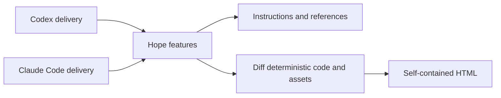

# Hope architecture

Hope is a set of focused features for working with AI.

The features and their product behavior are the core boundary.

This repository currently distributes them as one plugin for Codex and Claude
Code.

The delivery adapters expose the features but do not define their behavior.

There is no independent Hope CLI or harness in the current distribution.

## Product definitions

- [PRINCIPLES.md](../PRINCIPLES.md) defines the project direction.
- [align.md](align.md) defines Hope Align.
- [diff.md](diff.md) defines Hope Diff.
- [polish.md](polish.md) defines Hope Polish.
- [sweep.md](sweep.md) defines Hope Sweep.
- [toxic-review.md](toxic-review.md) defines Hope Toxic Review.
- [write.md](write.md) defines Hope Write.
- [design.md](design.md) defines the visual language used by Diff HTML.
- [release.md](release.md) defines the public package boundary.

## Product core and current delivery



The arrows point from each delivery adapter toward the same product behavior.

Hope features must not need to know which adapter exposed them.

Most Hope features are instruction-led.

Their behavior lives in a concise `SKILL.md` and optional references.

The selected feature assigns model judgment either to the active host or to a
fresh worker according to the conversation context boundary below.

Both use the host's normal tools, and the active host speaks with the person.

Diff also needs deterministic code.

That code captures an exact pull-request snapshot, bounds evidence, validates
citations, renders offline HTML, rechecks the source, and publishes without
overwriting an existing file.

## Folders

```text
hope/
├── .agents/             Codex local marketplace catalog
├── .claude-plugin/      Claude local marketplace catalog
├── assets/              Brand sources and README captures
├── docs/                Product and architecture definitions
├── e2e/                 Diff browser acceptance tests
├── plugins/hope/        Installable Codex and Claude package
├── test/                Deterministic and package tests
├── test-support/        Shared deterministic test fixtures
└── tools/               Build, validation, staging, and release scripts
```

Keep a Markdown file at the repository root when it governs the whole project,
must be found before a topic is chosen, or is discovered from a conventional
fixed path.

Put detailed product, feature, design, architecture, and release definitions
under `docs/`.

Keep guidance that applies only to one directory beside the files it governs.

Do not choose a documentation location from importance or file size alone.

`plugins/hope/skills/` is the current editable implementation of every feature.

That physical location reflects the one supported delivery, not the product
identity.

Do not generate Skill instructions from JavaScript.

The Diff Skill keeps deterministic code under `scripts/`, conditional analysis
guidance under `references/`, and private fonts and images under `assets/`.

Its fixed interface text stays under `scripts/locales/` because only the Diff
scripts consume it.

Diff-only helpers stay in the Diff Skill instead of presenting themselves as
shared project infrastructure.

`tools/build-plugin.mjs` copies `LICENSE` and `THIRD_PARTY_NOTICES.md` into the
current delivery package.

`tools/plugin-files.mjs` maps those two generated files to their editable source
and derives the exact package list.

Product definitions under `docs/` stay in the repository.

The installed features use their own `SKILL.md` files and references instead of
shipping another copy of those definitions.

License and notice text are copied without a banner.

Skill instructions, references, scripts, schemas, locale dictionaries, and
private assets are packaged directly from their editable paths.

Do not edit generated plugin files by hand.

## Current delivery package

```text
plugins/hope/
├── .codex-plugin/plugin.json
├── .claude-plugin/plugin.json
├── assets/
└── skills/
    ├── align/
    │   └── SKILL.md
    ├── diff/
    │   ├── SKILL.md
    │   ├── references/
    │   ├── scripts/
    │   └── assets/
    ├── polish/
    │   └── SKILL.md
    ├── sweep/
    │   └── SKILL.md
    ├── toxic-review/
    │   ├── SKILL.md
    │   └── references/
    └── write/
        ├── SKILL.md
        └── references/
```

Both host manifests point at the same `skills/` directory.

Host-specific metadata may describe discovery, but it must not define different
feature behavior.

Hope has no Settings Skill.

The active conversation supplies language and presentation preferences.

Hope has no product or release Model Evaluation framework.

Instruction-led Skill behavior is exercised manually with representative
prompts and normal product use.

## Feature boundary

A feature owns:

- when it should activate;
- the user's goal and supported scope;
- the model's decision and conversation rules;
- stopping and approval boundaries;
- references that are needed only in some runs; and
- how to use a deterministic script, when one exists.

The current Skill owns the feature's activation and workflow instructions.

The plugin manifests package these features but do not define their behavior.

A feature reference or script must not read a plugin manifest, marketplace
configuration, installed-cache path, or host-specific root variable.

Keep host-specific path resolution in `SKILL.md` or repository tooling.

Use generic host language in feature behavior and references.

Keep host names, manifests, marketplace steps, and cache paths in delivery
instructions or repository tooling.

Do not pre-create architectural layers for a possible future extraction.

If another delivery form earns its place, reorganize the feature without
rewriting its behavior.

A Skill does not need a schema merely to prove that the same model filled in a
structured record correctly.

Use a schema or script when another process consumes the result or when code
must independently enforce a boundary.

Keep the selected `SKILL.md` short.

Move detailed analysis methods, writing standards, and rare procedures into
`references/`.

## Conversation context boundary

Align and Write use the active conversation because shared decisions, meaning,
uncertainty, and voice are part of their product input.

Polish and Diff delegate their work to a fresh subagent that does not inherit
the conversation.

Every Toxic Review reviewer uses a fresh context, including a one-role review.

Sweep uses fresh contexts for disjoint batch inspectors while the active host
may inspect sequentially and merge evidence.

A fresh-worker handoff may contain the exact request, target, settled
contracts, explicit scope, direct evidence locations, and verification method.

It must not contain previous reasoning, drafts, failed approaches,
implementation narrative, prior conclusions, or another worker's output.

When fresh context is required but unavailable, the Skill stops instead of
performing the same judgment in the active conversation.

## Align boundary

Align finds material misunderstandings before implementation.

The host inspects available project evidence, teaches back its current
understanding, and asks only about intent, preference, work rules, or a material
choice.

Align keeps repository facts, user decisions, AI proposals, assumptions, open
questions, and uncertainty distinct in the conversation.

It proposes implementation only after no material blocker remains.

It waits for explicit user approval.

Align does not create HTML, persist a session record, invoke Polish, or implement
the task.

## Polish boundary

Polish refines one named, completed work product after the person asks for a
bounded finishing pass.

It does not perform initial implementation, feature changes, architecture
migrations, or broad restructuring.

Preserving existing behavior during those tasks does not make them Polish.

It inspects the exact target, states a short preservation contract, makes at
most one revision round, and verifies the checked scope.

It stops when a material product choice is required.

A no-change result is valid.

The active host delegates the pass through a task-local handoff and does not
inspect, revise, or verify the target as the Polish worker.

The fresh worker uses the host's normal file tools and does not create a private
runtime record.

## Sweep boundary

Sweep is read-only.

It inventories the project, discloses exclusions and gaps, reports evidence,
and proposes an ordered maintenance plan.

It does not edit files, create approval records, invoke Polish, or claim complete
coverage when inspection was partial.

The person may select a candidate and start a separate implementation task.

## Toxic Review boundary

Toxic Review is strict about the work and respectful toward people.

The active host chooses the smallest useful reviewer role set.

Every reviewer role uses a fresh subagent context.

One focused review is valid when additional roles would repeat evidence.

The active host adjudicates findings by scoped evidence and impact rather than
reviewer votes or hidden conversation context.

No finding is a valid result.

Detailed causal-review guidance lives in a conditional reference.

Toxic Review does not use a custom model adapter or persist a role-run state
machine.

## Write boundary

Write drafts, edits, or reviews language while preserving meaning, facts,
uncertainty, citations, exact text, and intended voice.

Its writing standard is a reference shared by project instructions and the
Write Skill.

Other Skills may apply that standard without invoking Write as a second feature.

## Diff boundary

Diff explains one exact GitHub pull request and publishes a private,
self-contained HTML review.

The Skill confirms the requested scope and target.

The deterministic path then:

1. resolves one pull request;
2. captures its base, head, merge base, files, patches, and bounded context;
3. exposes stable source IDs to the fresh analysis worker;
4. validates analysis references against the captured sources;
5. renders one offline HTML file with escaped authored content;
6. rechecks the pull-request revisions before publication; and
7. creates a new output file without replacing an existing one.

The fresh analysis worker owns review judgment and prose.

The active host owns target confirmation, explicit display choices, and final
artifact handoff.

The runtime owns source identity, input bounds, deterministic rendering, and
safe publication.

The Diff analysis reference owns teaching-aid selection and authoring rules.

For teaching aids, the runtime keeps only the enums, validation and metrics,
fixed limits, and bounded microworld skeleton logic.

Private working state is temporary and belongs to one run.

Hope removes it after success or cancellation when ownership is certain.

Large pull requests may stop with a clear size or context limit.

Hope does not need resumable multi-generation evaluation machinery merely to
avoid reporting that limit.

## Self-contained Diff Skill

The Diff Skill cannot depend on a repository `node_modules/` directory or a
network request while rendering.

Its deterministic modules, schemas, locales, fixed fonts, and favicon live
beside its `SKILL.md` and ship from those editable paths.

Code evidence uses escaped text and fixed patch-line roles, so rendering does
not need a language grammar bundle.

`tools/plugin-package-files.txt` is the exact release allowlist.

An unrelated file under `plugins/hope/` cannot enter a release accidentally.

## Tests

Tests follow the supported boundaries.

- Skill tests check metadata and reference packaging.
- Node tests cover Diff parsing, snapshots, citations, rendering, stale-source
  checks, bounded input, and safe publication.
- Browser tests cover Diff layout, keyboard behavior, accessibility, responsive
  navigation, no-JavaScript behavior, and print.
- Package tests verify the direct Skill sources, generated legal files, and
  exact release allowlist.

There are no harness-parity, Settings, Model Evaluation, Align renderer, or
legacy-record tests.

Linux runs the full deterministic suite on Node.js 22 and 24.

macOS and Windows run focused Node.js 22 installation and path smoke tests.

Representative-prompt checks for instruction-led Skills are development and
product smoke, not an automated release or model-evaluation gate.

## Add a feature

1. Start with a clear user goal.
2. Define the product behavior under `docs/`.
3. Create one concise Skill.
4. Add a reference only for conditional detail.
5. Add a script only for a deterministic or external-state boundary.
6. Test discovery and the remaining deterministic promises.

Do not add a generic runner, manager, engine, registry, shared state machine, or
compatibility layer without a concrete second use and a documented product
need.
