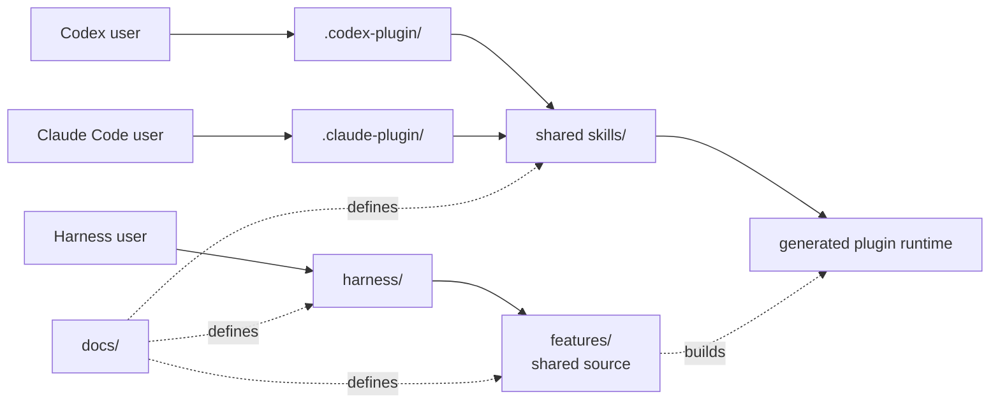

# Hope architecture

Hope has two entry paths into the same feature code: an independent harness and
host plugins or Skills.

The shared Claude and Codex Skills provide the first complete diff path.

The harness already owns the same non-model boundaries, but reports that its AI
adapter is not available yet.

The project definitions are:

- [PRINCIPLES.md](../PRINCIPLES.md) defines the project direction;
- [diff.md](diff.md) defines Hope diff;
- [align.md](align.md) defines Hope align;
- [polish.md](polish.md) defines Hope polish;
- [toxic-review.md](toxic-review.md) defines Hope toxic review;
- [write.md](write.md) defines Hope write; and
- [design.md](design.md) defines the shared visual language.

## Two tracks



The harness runs without a plugin or AI host.

A Skill is a thin host adapter.

It may add instructions for an AI, but it does not own feature behavior.

The dependency direction is:

```text
harness -> features <- host adapters
```

Feature code never imports a Skill, plugin manifest, or host adapter.

## Folders

```text
hope/
├── .claude-plugin/     Claude Code marketplace catalog
├── design/             Shared visual tokens and fixed assets
├── docs/               Shared product definitions
├── entrypoint/         Shared direct-command detection
├── features/           Feature code used by every entry path
├── harness/            Independent Hope commands
├── locales/            Shared fixed interface text
├── plugins/hope/       Codex and Claude Code package
├── settings/           Shared user preference code
├── test/               Behavior and boundary tests
└── tools/              Project checks
```

Root `docs/`, `entrypoint/`, `features/`, `settings/`, `locales/`, and `design/`
are editable sources.

Both hosts install `plugins/hope/` as one package directory, so the plugin
contains generated copies of those sources.

`tools/build-plugin.mjs` creates the copies.

The release check requires each copy to match its source.

Never edit a generated copy by hand.

The package includes every Hope file it uses, but its JavaScript commands still
require Node.js 20 or newer.

The root harness loads syntax-highlighting dependencies from the locked Node
package graph.

The plugin build bundles the fixed highlighter, GitHub light and dark code
themes, and supported language grammars into its generated runtime.

The installed Claude or Codex plugin therefore does not depend on a separate
`node_modules` directory or a network request.

`tools/plugin-package-files.txt` is the explicit release boundary.

The release copies only those files into a new staging directory before creating
the zip.

An unrelated or temporary file under `plugins/hope/` cannot enter a release by
accident.

A public plugin version identifies one immutable package.

After its matching tag exists, the project check rejects package changes until
the public version changes.

During development, one command rebuilds and validates the package, reinstalls
it through the configured local `hope` marketplace, and checks every cached file
against its source.

It never changes the tracked manifests or marketplace configuration.

The package has two host manifests:

```text
plugins/hope/
├── .codex-plugin/plugin.json
├── .claude-plugin/plugin.json
├── skills/align/SKILL.md
├── skills/diff/SKILL.md
├── skills/polish/SKILL.md
├── skills/settings/SKILL.md
├── skills/toxic-review/SKILL.md
├── skills/write/SKILL.md
├── docs/                  generated product definitions
└── runtime/               generated feature code
```

The manifests are host adapters.

They do not define feature behavior.

The shared Skill may explain how each host locates the package, but it must
reach the same generated command.

## Current diff boundary

The current diff implementation starts from [diff.md](diff.md).

It collects an exact GitHub pull-request snapshot, exposes bounded inspection
pages, validates one structured analysis, rechecks the snapshot, and publishes
one private self-contained HTML file without replacing an existing file.

The Skill receives a bounded window of inspection pages and writes one ordered
checkpoint entry for every page in that window.

The shared runtime validates the whole submitted window before changing state.

It then stores each page checkpoint as its own immutable, digest-chained record.

This keeps page-local citations and prefix-safe crash recovery while reducing
host-model round trips.

A checkpoint transition reads the manifest, one bounded inspection window, and
one bounded state summary.

It returns the next inspection window in the same process.

The explicit inspection command remains the replay path after lost or truncated
output.

The durable ledger retains every page checkpoint, including empty records.

When the Skill later reads the bounded analysis view, the runtime omits empty
checkpoint bodies and places exact excerpts from the bound snapshot beside the
model-authored notes they support.

This gives every supported host durable review memory without assuming that its
model will retain every earlier page.

Only a checkpointed question can create a context request.

The Skill can ask the shared runtime to collect selected request IDs at the
captured head or merge-base revision.

The runtime preserves earlier evidence and appends an inspection generation
containing only the new context sources or limits.

The context transition returns that generation's first page in the same
process.

Its committed operation receipt lets the same request IDs replay that result
without another provider fetch.

The Skill reads and checkpoints only that generation.

The runtime does not keep a daemon alive between commands.

Each command uses a shared fenced mutation lease, makes one bounded,
recoverable transition, and then exits.

Generation receipts keep analysis from mixing uninspected context with earlier
evidence.

The Claude and Codex Skills provide the first complete AI analysis path.

They can use the active host session to produce a structured analysis.

The harness shares settings, collection, validation, rendering, and lifecycle
code.

It must not claim automatic AI analysis until it has a real model adapter of its
own.

These are two honest entry boundaries to one feature implementation, not
separate diff implementations.

The shared diff runtime loads the writing standard from the write core and
returns it with each prepared run.

The shared Diff core also exposes a versioned invocation contract before a host
starts `prepare`.

The contract owns the possible invocation decisions, confirmation lifecycle,
target-binding rules, model policy, and representative cases.

The active Claude or Codex host interprets natural language against that
contract, while the Skill remains a thin adapter and does not call another
classifier model.

The independent harness keeps its structured commands as explicit operation
selection.

A future harness natural-language entry may use a replaceable model adapter.

The adapter may choose a different model from the plugin host, but it uses the
same decision shape, confirmation state, failure policy, and evaluations.

The harness must keep reporting the missing model boundary until that adapter
exists.

The shared core exposes a read-only target-resolution operation for ambiguous
review requests.

The host resolves and binds an exact pull request before confirmation, then
passes that canonical URL to `prepare` after authorization.

Automatic target discovery cannot replace a target that the person already
confirmed.

The shared `confirmation-create` command creates the digest-bound pending state.

The shared `confirmation-transition` command re-hashes the original request and
applies the deterministic reply transition after a host classifies the reply.

The root command, independent harness, and generated plugin expose both
operations through the same core boundary.

A number-only authorized retarget inherits the pending repository, and the host
passes one canonical URL to `prepare` without selector fallback.

The runtime also returns the versioned teaching-aid decision, selection, and
authoring-safety contract with representative evaluation cases, and can generate
the complete condition skeleton for a bounded microworld.

The validator keeps every decision and its reason.

The renderer shows all three decisions, including intentional omissions, in the
final artifact.

The Skill combines those runtime contracts with its remaining compact evidence
rules and the generated analysis schema.

It does not carry another copy of the writing or teaching-aid rules or load the
full human-facing product and design documents for every review.

Those documents remain the source of truth for implementation and maintenance.

The runtime validator and renderer own their fixed behavior.

## Current align boundary

The current align implementation starts from [align.md](align.md).

The active Claude or Codex host inspects available evidence and conducts the
adaptive interview.

The shared core owns the brief, structured-state validation, readiness
derivation, resource preflight, and deterministic HTML rendering.

The HTML is a snapshot of the current shared understanding.

Repository facts, user decisions, AI proposals, and open items stay distinct.

The runtime escapes all authored text and never replaces an existing artifact.

The independent harness exposes the same brief, validator, and renderer.

It reports that automatic interviewing is unavailable until it has a model
adapter.

The Skill is an adapter to the generated copy of that core.

When Align reaches a contract-ready approval candidate, its shared core binds
the normalized candidate to an exact digest.

The host invokes Polish once for that candidate, then uses Align's shared
`complete-polish` transition to revalidate the resulting state and attach a
digest-bound receipt.

The receipt prevents another pass over the same candidate.

The dependency direction is `Align -> Polish`; Polish does not import or invoke
Align.

## Current polish boundary

The current polish implementation starts from [polish.md](polish.md).

The active Claude or Codex host inspects an exact target snapshot, creates one
run-specific plan, performs at most one bounded revision, and records its
verification.

The shared core validates target and output identities, preservation and
evidence links, the change budget, and no-change or needs-alignment outcomes.

It also records the verification scope and whether a revision is only proposed
or was applied with captured authority and identity checks.

The independent harness exposes the same brief and validator.

It does not claim automatic AI editing without a model adapter.

The Skill coordinates the active host but does not own the Polish contract or
result status.

Polish uses the shared Write standard for language-bearing changes.

## Current toxic-review boundary

The current toxic-review implementation starts from
[toxic-review.md](toxic-review.md).

The active host chooses a small set of target-specific review roles and may run
them as independent subagents.

The shared core owns the bounded role and finding contract, source binding,
final adjudicated result, priority ordering, and deterministic resource metrics.

Its brief also offers one optional causal-completeness perspective when a named
work product makes or relies on a material causal claim.

That perspective reviews the captured claim and relevant flow; it does not
diagnose a raw symptom, execute a new experiment, or make every review role
repeat the same causal sequence.

When selected, the role marks its method and writes one structured causal
analysis into the shared result.

The shared validator binds that record to the selected role and sources, then
checks flow dispositions, candidate links, candidate count, cause level, and
the next-check shape.

The Skill does not own or duplicate this record contract.

The harness exposes the same brief and validator.

The same core owns blinded causal-evaluation cases, brief variants, exact case
and invocation bindings, and deterministic receipt validation.

The harness and generated plugin runtime expose identical evaluation-prepare,
single-receipt validation, and receipt-set validation commands.

The active Skill supplies the model execution and evaluator judgment.

The deterministic tests do not claim that they ran a host model.

It does not claim automatic multi-agent review without a model adapter.

The Skill coordinates host agents but does not own review status or metric
derivation.

## Shared work snapshots

Align and Toxic Review use `features/work-snapshot/` to bind a work product to
captured conversation, Git, file, URL, or artifact sources.

This shared boundary validates full Git object IDs, content digests,
structured-input depth, and resource bounds.

It does not own either feature's interview or review behavior.

## Shared result validation

Align, Polish, and Toxic Review use `features/result-validation/` for the
accumulator-style mechanics shared by their structured-result validators.

The helper owns plain-object, text, choice, list, identifier, and reference
validation.

Each feature still owns its schema, limits, reference vocabulary, cross-field
rules, normalized result, and resource metrics.

Work-snapshot validation keeps its separate fail-fast boundary.

Diff fails fast on snapshot and run identity because later checks cannot be
trusted without them.

After identity succeeds, Diff collects independent analysis contract errors
and returns them together with stable codes and JSON paths.

The runtime derives code-step file IDs from validated evidence when the model
omits that compatibility field.

## Shared command options

Align, Diff, Polish, and Toxic Review use `features/command-options/` to
tokenize their shared command-line option form.

Each feature still owns its allowed options, repeatable options, command
semantics, usage text, and error vocabulary.

The harness, settings, and release tools keep their own parsers because their
commands have different forms and boundaries.

## Shared command entrypoint detection

Command modules and project scripts use `entrypoint/` to determine whether
Node invoked their module directly.

It resolves symlinked paths and returns false when the entry path is absent or
cannot be resolved.

It only controls direct command execution; each caller keeps its command
parsing and error behavior.

## Current write boundary

The write implementation starts from [write.md](write.md).

The editable writing standard lives only in `features/write/standard.md`.

The feature core returns the versioned standard, its representative decision
examples, and a `draft`, `edit`, or `review` response contract.

The Claude and Codex Skills choose a mode and ask the generated runtime for the
same brief.

They do not carry another copy of the writing rules.

The independent harness routes `hope write` to the same feature.

Automatic writing reports that its model adapter is unavailable until the
harness has one.

Diff uses the same core standard for its generated review prose.

Its feature-specific authoring contract adds evidence and uncertainty rules.

Project work also uses Write as a required cross-cutting pass whenever clearer
language would improve an input, implementation, prompt, update, or final
response.

The active host asks the Write runtime for the current brief and applies it
without moving another feature's behavior into Write.

Claude Code loads the same project instructions through `CLAUDE.md`, which
imports `AGENTS.md` instead of copying its rules.

Before the independent harness delegates an AI feature, it attaches a Write pass
for the input and response.

A future harness model adapter must use that pass.

Fixed protocol output remains deterministic and is edited at its source.

## Add a feature

1. Start with a clear user goal.
2. Put shared behavior in `features/<name>`.
3. Expose it through `harness/`.
4. Add a thin skill only when an AI host needs one.
5. Add shared helpers only after two real features need the same rule.

Do not call a feature complete because its Skill or plugin manifest validates.

Require a test that proves every supported entry path reaches the same core
boundary.

Use names that describe the work or data.

Do not add a generic runner, manager, engine, registry, or base class without a
concrete second use.
