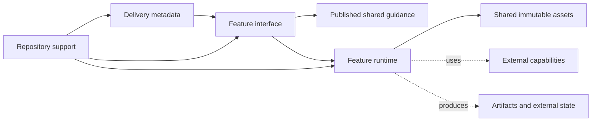

# Hope architecture

This document is the durable structure contract for Hope.

It defines stable responsibilities and dependency direction. It does not list
the current features, tool commands, test matrix, or release procedure.

## Authorities

- [PRINCIPLES.md](../PRINCIPLES.md) defines why Hope chooses its product and
  structural direction.
- Each `plugins/hope/skills/<feature>/SKILL.md` defines one feature's behavior.
- A Skill's `references/` directory owns its detailed or conditional guidance.
- [design.md](design.md) defines Hope's GUI and artifact visual contracts.
- [release.md](release.md) defines the public package and release process.
- [CONTRIBUTING.md](../CONTRIBUTING.md) defines development commands and work
  procedure.
- This document defines the boundaries those sources must preserve.

Link to an authority instead of keeping a parallel description. Another file
may state the same subject only when it owns a distinct contract or obligation.

## Layers and responsibilities

### Delivery metadata

Host catalogs, manifests, and discovery metadata expose Hope. They may point to
a feature and describe how to discover it, but they do not define its behavior.

### Feature interface

Every feature has one editable Skill boundary under
`plugins/hope/skills/<feature>/`.

`SKILL.md` owns model judgment and conversation flow. `references/` owns detail
loaded for a specific need. A published shared reference may guide more than
one feature when that shared contract has real consumers.

### Feature runtime

A feature may keep scripts, schemas, locales, and private assets inside its
Skill boundary when it must control external state or produce a deterministic
result.

Runtime code belongs to its owning feature. It does not import a sibling
feature or repository support code. A feature may read Hope-wide immutable
brand assets owned by the plugin.

### Repository support

Repository documentation, tools, tests, and CI may build or verify delivery
metadata and feature sources. Product sources do not depend on repository
support.

The package builder collects and verifies the current distribution. It is not
a product runtime or an independent Hope compiler.

### Runtime effects

Feature-specific contracts own the guarantees for external capabilities,
temporary state, safe publication, and generated artifacts. These are runtime
effects rather than repository source dependencies.

## Dependency direction

Solid arrows point from repository sources to their source dependencies.
Dotted arrows point from runtime to effects whose guarantees belong to the
owning feature.

The stable rules are:

- Delivery metadata describes a feature but cannot add or change behavior.
- Feature references and runtime code do not read a manifest, marketplace
  configuration, installed-cache path, or host-specific root variable.
- Host-specific path resolution stays in `SKILL.md` or repository tooling.
- Feature runtime imports stay inside the owning Skill.
- Cross-feature source dependencies need an explicit shared contract. Private
  feature implementation is not shared.
- Shared code needs two real consumers with the same invariant.
- Generated package files name their editable source and are not edited by
  hand.
- Another delivery path or product runtime requires a demonstrated user need.

## Enforcement boundary

CI enforces only relationships it can determine without rejecting valid
designs:

- every discovered feature directory has one `SKILL.md`;
- relative module imports in feature runtime stay inside the owning Skill;
- static `import.meta.url` resources stay inside the owning Skill or the shared
  plugin assets directory;
- feature references and runtime code stay independent of delivery packaging;
  and
- an explicit cross-feature file reference targets published shared guidance.

Review and feature tests own rules that require meaning or runtime data. These
include whether metadata changes behavior, whether a script has earned its
place, whether an external capability is appropriate, and whether a computed
runtime path is safe.

Changing a current feature, command, file list, asset consumer, test platform,
or release step does not change this contract unless it changes a layer,
responsibility, or dependency direction.
